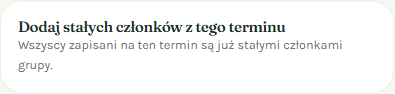
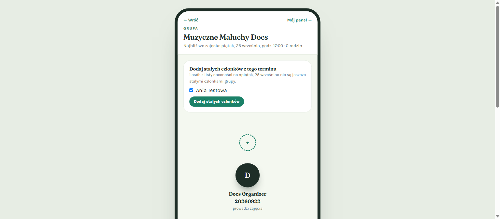
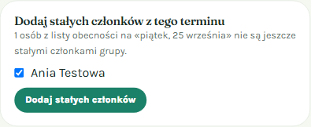
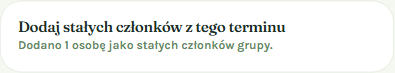
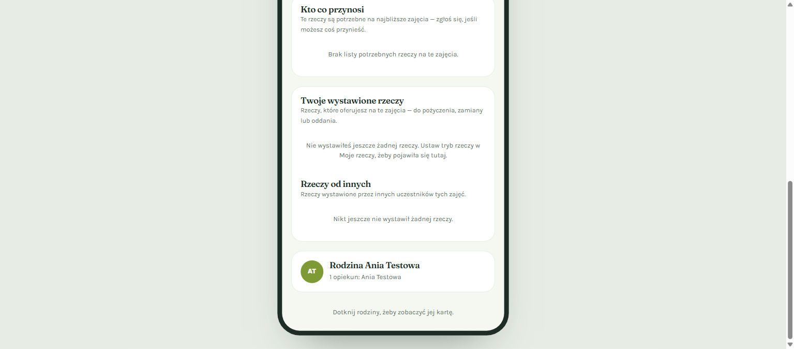
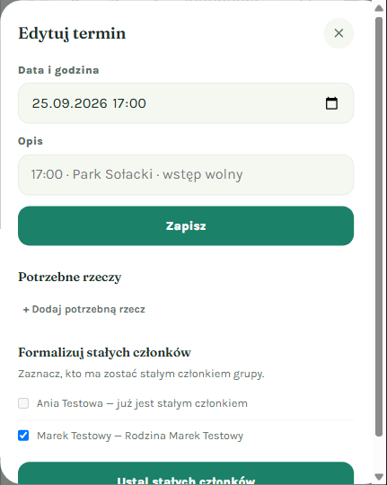
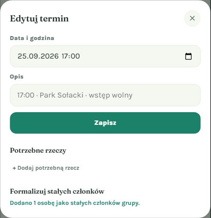
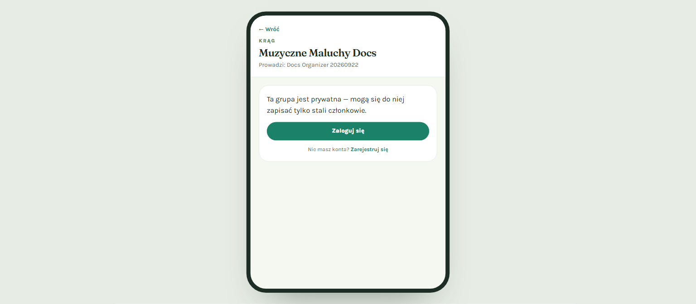

# Adding Standing Members from a Class Meeting

*Last updated: 2026-09-22*

## What is this?

Whenever people sign up for one of your group's meetings (a "term"), that sign-up only counts for that single meeting. If you want some of those people to become **standing members** of your group — so they're recognized as regulars, show up in your group's member picture, and don't have to re-sign-up every time — you can now promote them directly from the attendance list.

The best part: doing this **never changes who can join your group**. Your group stays exactly as open (or as closed) as it was before. Adding standing members and controlling who can sign up for new meetings are now two completely separate decisions.

## Who should use this?

Any organizer who runs recurring meetings — a music class, a playgroup, a sports session — and wants to build a reliable list of regulars while still welcoming new families to try out a session.

- ✅ Running a class where most people come back every week and you want a proper "member list"
- ✅ You don't want your class to stop accepting drop-in sign-ups just because you added some standing members
- ✅ Some of your attendees signed up without a family profile (for example, an adult who came alone) — they can now be added too

## Before you start

- You need to be the **organizer** of the group.
- The group needs to have a meeting ("term") with at least one person signed up.
- You'll do this from either of two places — pick whichever is more convenient:
  1. Your group's own page (the page your visitors see, `/krag/...`)
  2. The internal admin panel at `/panel`, from the "Edit term" dialog

Both places work the same way and show the same results.

---

## Adding standing members from your group page

This is the quickest way, since you're probably already looking at your group's page when you notice who showed up.

### Step 1: Find the card on your group page

Below your usual meeting controls, you'll see a card titled **"Dodaj stałych członków z tego terminu"** ("Add standing members from this meeting"). It tells you how many people from the latest meeting's sign-up list aren't standing members yet.

💡 **Tip**: If everyone who signed up is already a standing member, the card just shows a short message like the one above and there's nothing else to do.

Here's the same area of the page in its normal context, at the top of your group page next to your other meeting controls:

### Step 2: Review the checklist

When there's someone new to add, the card expands into a checklist of everyone who attended and isn't a standing member yet. Everyone is **pre-selected** — just uncheck anyone you don't want to add.

📝 **Note**: Every attendee can be selected here — even someone who signed up without setting up a family profile (for example, a solo adult attending a class with no kids). You no longer need a "family" on file to become a standing member.

### Step 3: Add them

Click **"Dodaj stałych członków"** ("Add standing members"). You'll see a confirmation message right away:

✅ **What you should see**: A message like "Dodano N osób jako stałych członków grupy." (Added N people as standing members of the group.) The people you added now show up in your group's member picture, even if they don't have a family of their own — they'll appear as their own small "solo family" so they're never left out of the picture.

⚠️ **Important**: Notice that nothing about your group's visibility changed. If your group was open for anyone to sign up before, it still is — this action only adds standing members, it never locks the group down.

**What if I made a mistake?** There's no "undo" button on this card — but adding someone as a standing member doesn't remove them from anything or restrict future sign-ups, so there's very little risk in trying it. If you need to remove someone as a member entirely, do that from your group's membership management elsewhere in the panel.

---

## Adding standing members from the admin panel (`/panel`)

If you're already editing a meeting's details in the internal admin panel, you can add standing members from the same dialog — no need to leave and go to your group page.

### Step 1: Open "Edit term"

From your panel's meetings list, click **"Edytuj termin"** ("Edit term") on the meeting you want to work from.

### Step 2: Scroll to "Formalizuj stałych członków"

Inside the edit-term dialog, below the meeting details and needed-items list, you'll find the **"Formalizuj stałych członków"** ("Formalize standing members") section. It works exactly like the card on your group page:

- People who are **already** standing members show up grayed out with a note next to their name, so you know at a glance who's already covered.
- Everyone else is selectable and pre-checked.

### Step 3: Submit

Click **"Ustal stałych członków"** ("Confirm standing members"). The section shows the same confirmation message as the group-page card:

✅ **What you should see**: "Dodano N osób jako stałych członków grupy." — and, again, your group's public/private setting is completely untouched by this action.

---

## What if someone wants to join a private group?

If your group is set to **Prywatna** ("Private — standing members only, via join link"), only signed-in accounts can use the group's join link to become a member. This keeps your standing membership list trustworthy — every member maps to a real account.

If someone who isn't logged in tries to open your private group's join link, they'll now see a clear message asking them to log in or create an account first, instead of being let in anonymously:

💡 **Tip**: Share your private group's join link only with people you expect to log in or register — there's no more "join as a guest" option for private groups. (Public groups you haven't made private yet are unaffected — anyone can still RSVP to an upcoming meeting there without an account.)

**What if my visitor doesn't have an account yet?** They can click "Zarejestruj się" ("Register") right from that same message, create an account, and then come back to the join link to finish joining. They'll need to navigate back to the link themselves after registering — it isn't remembered automatically.

---

## Frequently asked questions

**Does adding standing members make my group private?**
No. This used to be the case, but not anymore. Adding standing members and changing your group's public/private setting are two completely independent actions. If you also want to make your group private, do that separately from your group's edit settings.

**Can I add someone who doesn't have a family set up?**
Yes. Every attendee is selectable regardless of whether they have a family profile. If they don't have one yet, the system automatically creates a simple "solo family" for them behind the scenes so they still show up correctly in your group's member picture.

**I don't see the "Dodaj stałych członków" card on my group page — why?**
This card only appears for the group's organizer, and only when there's an upcoming or current meeting to promote attendees from. If you're viewing the group as a visitor (not logged in as the organizer), you won't see it.

**Will people who already RSVP'd anonymously lose their spot if I don't promote them?**
No — promoting someone to a standing member is optional and additive. Anyone who signed up for a meeting keeps their sign-up whether or not you promote them.
