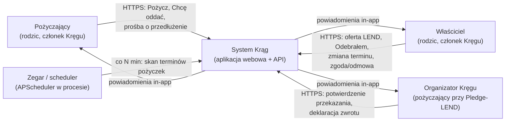
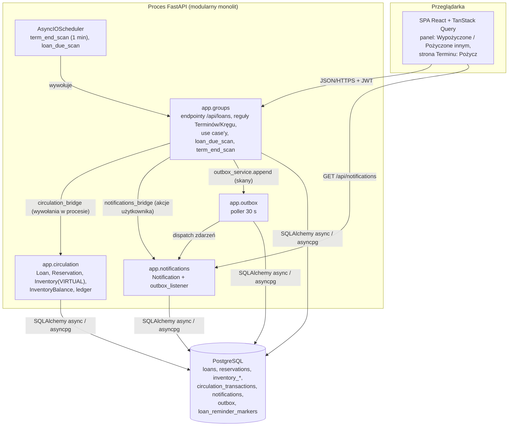
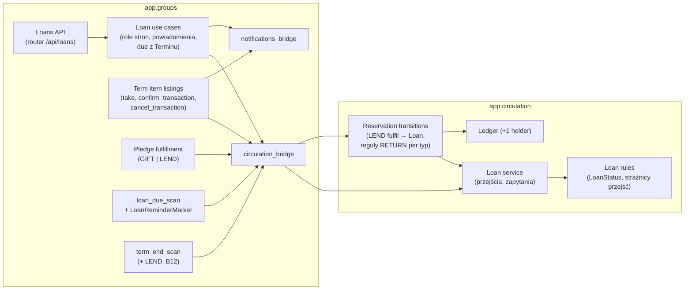
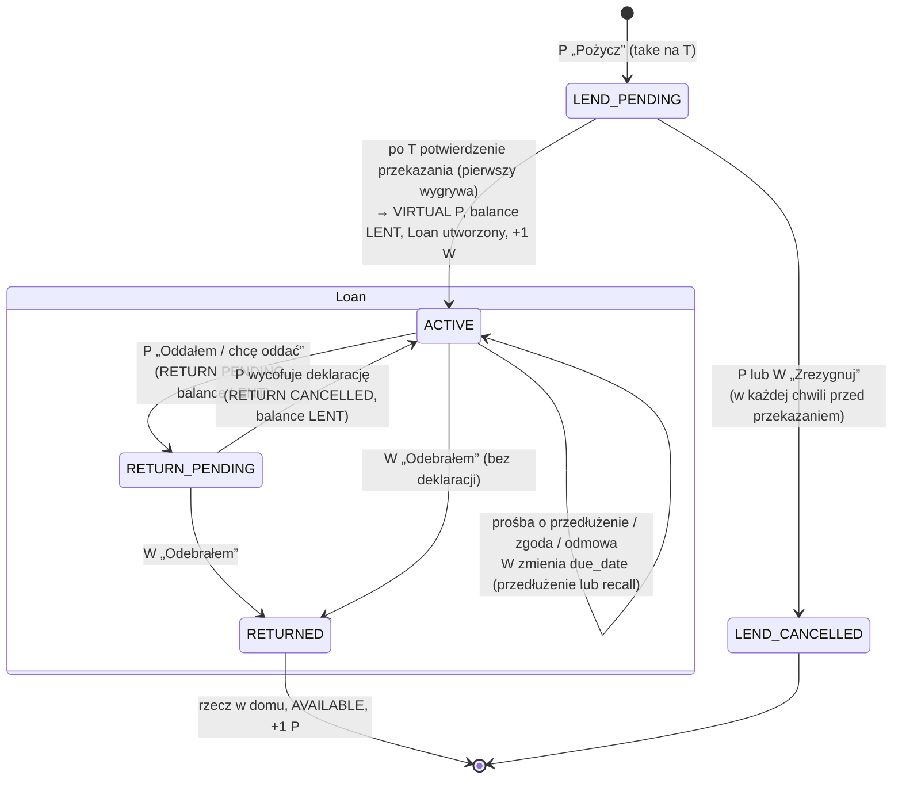
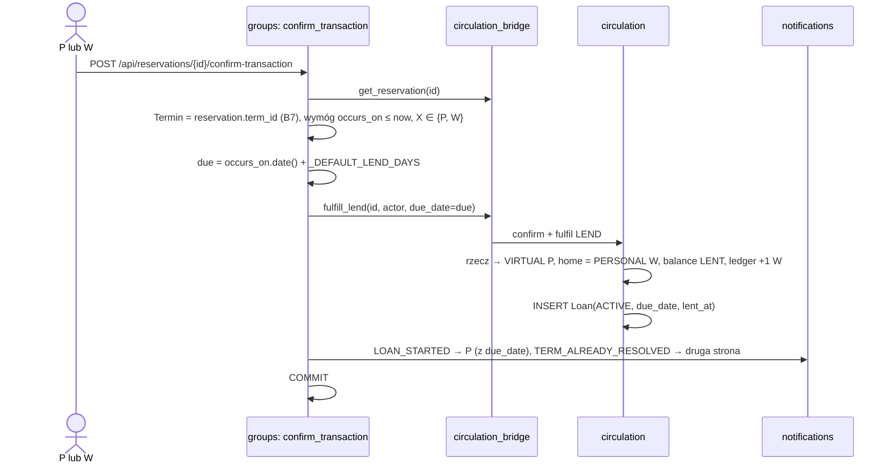
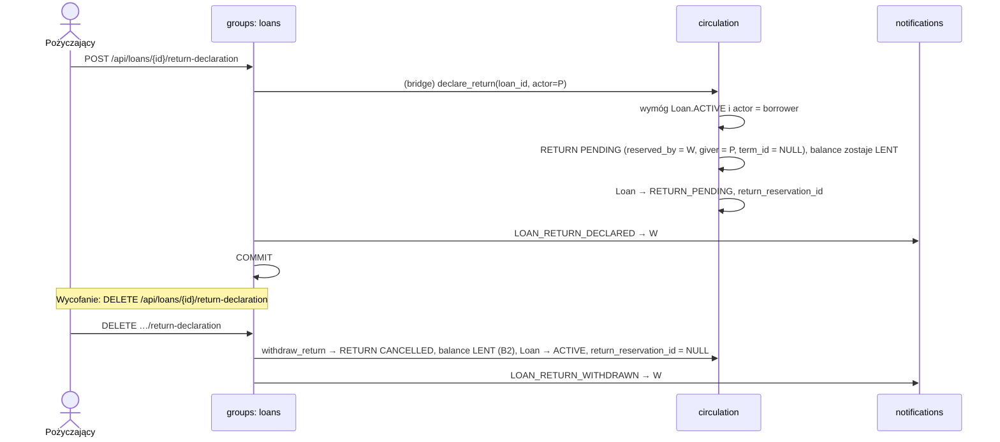
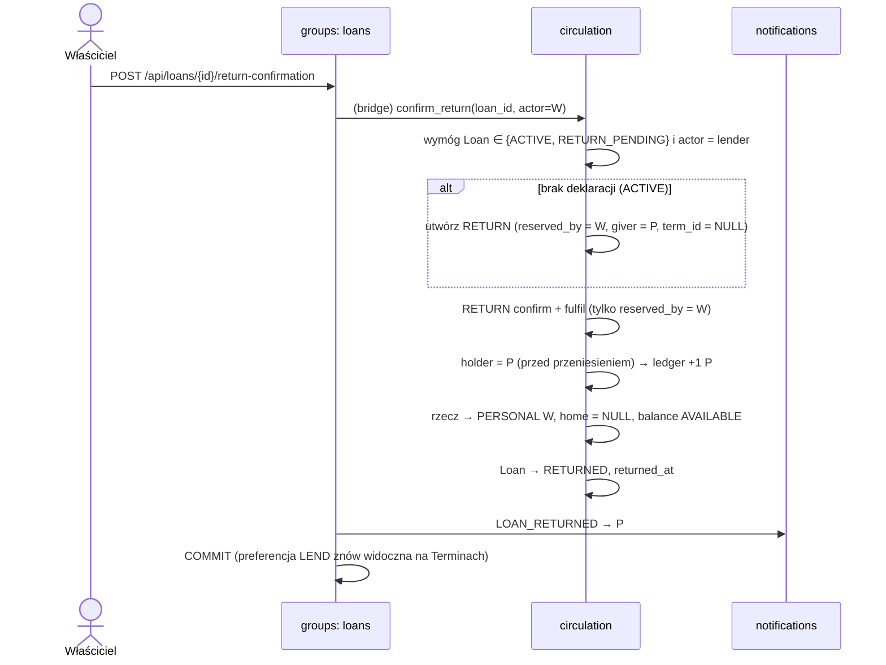
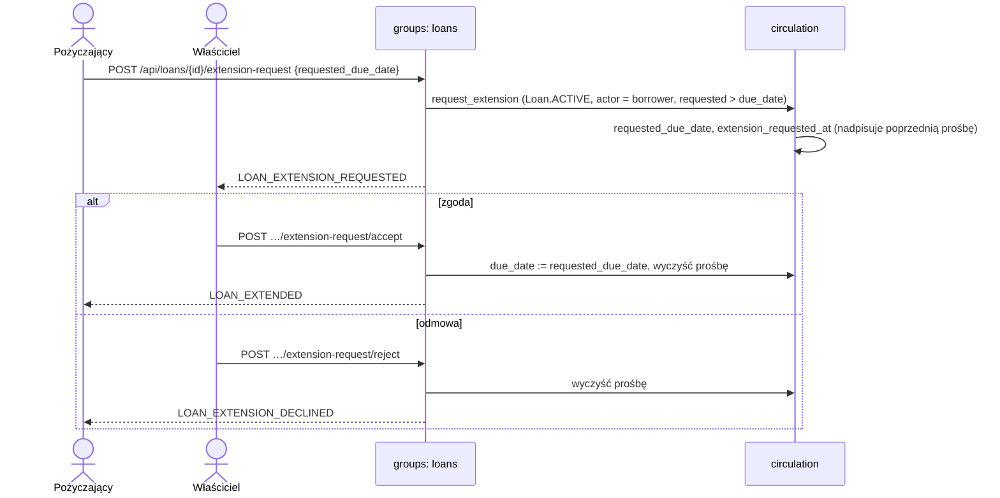
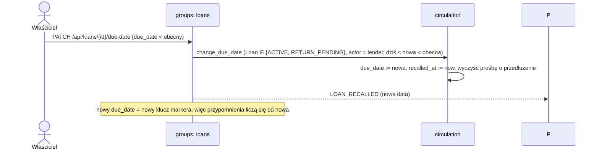
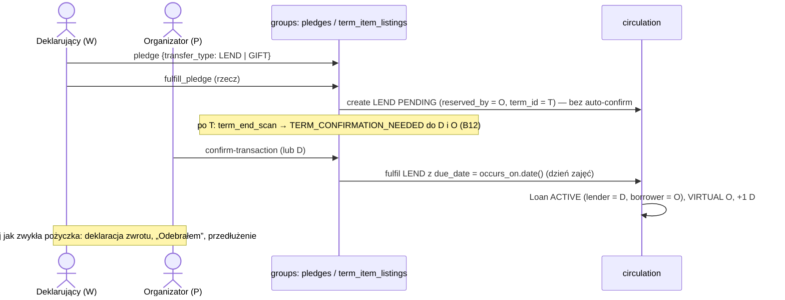

# Projekt wysokopoziomowy: cykl życia wypożyczenia (LEND) — `Loan` nad magazynem VIRTUAL

**Data:** 2026-09-25 · **Autor:** solution-designer (maister) · **Wejście:** `outputs/solution-exploration.md`
(zbieżność z fazy 4), `analysis/synthesis.md`, `outputs/research-report.md` (§4.3 błędy, §5.3 zdarzenia,
§5.4 UI), `project/tech-stack.md`, `project/architecture.md`, standardy `backend/models.md`,
`backend/migrations.md`, `backend/security.md`, `backend/api.md`, `frontend/data-fetching.md`,
`global/minimal-implementation.md`.
**Rejestr decyzji:** [`decision-log.md`](decision-log.md) (ADR-001 … ADR-010).

Skróty: **P** = pożyczający, **W** = właściciel (pożyczający innym), **S** = system (scheduler),
**T** = Termin (spotkanie Kręgu). **B#** = błąd z raportu §4.3, **E#** = zdarzenie z §5.3.

---

## 1. Przegląd projektu

**Kontekst biznesowy.** W Kręgu rodzice pożyczają sobie rzeczy na Terminach. Dziś działa tylko
pierwsza połowa wypożyczenia: oferta, wzięcie i przekazanie. Zwrot to jeden przycisk
pożyczającego, bez udziału właściciela. Właściciel nie widzi swoich pożyczonych rzeczy, a termin
zwrotu jest nadpisywany i nikt go nie czyta. Do tego dochodzą dwie luki bezpieczeństwa w surowych
endpointach rezerwacji (B6, B7). Zyskują obie strony: właściciel odzyskuje kontrolę nad swoją
rzeczą, a pożyczający dostaje jasny termin i przypomnienia.

**Wybrane podejście.** Rzecz przy przekazaniu nadal trafia do **magazynu VIRTUAL pożyczającego**
(`home_inventory_id` wskazuje dom). Nowym elementem jest **encja `Loan` w `app.circulation`**,
która przechowuje stan jednej pożyczki. Tworzy ją potwierdzenie przekazania. Łączy jawnie
rezerwacje LEND i RETURN, strony, daty i status (`ACTIVE` → `RETURN_PENDING` → `RETURNED`).
Architektura pozostaje **modularnym monolitem z granicami DDD**:

- `app.circulation` zna tylko pożyczki, rezerwacje, magazyny i ledger;
- `app.groups` posiada endpointy, reguły Terminów i Kręgu, powiadomienia oraz skan przypomnień;
- `app.groups` woła circulation wyłącznie przez `circulation_bridge`.

**Zwrot jest dwustronny i zawsze poza Terminami.** Pożyczający deklaruje zwrot. Właściciel zamyka
pożyczkę przyciskiem „Odebrałem”, także bez wcześniejszej deklaracji.

**Kluczowe decyzje:**
- **VIRTUAL + `Loan`** zamiast modelu z dokumentu INV („rzecz zostaje u właściciela”). Holder,
  ledger i blokada podnajmu działają bez zmian. Odstępstwo zapisuje ADR-001.
- **`Loan` w circulation, akcje w groups przez bridge.** To ten sam wzorzec co
  `confirm_transaction` (ADR-002).
- **Pożyczkę zamyka tylko właściciel.** Zwrot odbywa się prywatnie, poza Terminami, bez bramki
  Terminu. Punkt +1 pożyczający dostaje dopiero przy „Odebrałem” (ADR-003).
- **`due_date` = dzień Terminu przekazania + 14 dni.** Przedłużenie to prośba i zgoda. Recall
  ustawia wcześniejszą datę (ADR-004).
- **Osobny skan `loan_due_scan`** z markerem per (`loan_id`, `kind`, `due_date`, `sequence`)
  i limitem 3 przypomnień o zaległości na jedną wartość `due_date` (ADR-005).
- **Spory i strata poza systemem.** Nie ma stanów DISPUTED/LOST (ADR-006).
- **Krok 0 (B6, B7, B10, B12) przed MVP** (ADR-008).

---

## 2. Architektura

### 2.1 Kontekst systemu (C4 poziom 1)



Zamienniki ASCII (dla czytników bez mermaid):

```
[Pożyczający] --HTTPS--> [System Krąg] <--HTTPS-- [Właściciel]
[Organizator] --HTTPS--> [System Krąg] <--tick--  [Scheduler (w procesie)]
[System Krąg] --powiadomienia in-app--> [Pożyczający | Właściciel | Organizator]
```

Nie ma systemów zewnętrznych, bo kanał powiadomień jest tylko in-app. Sam zwrot odbywa się
fizycznie **poza systemem i poza Terminami**. System tylko go rejestruje.

### 2.2 Kontenery (C4 poziom 2)



| Kontener | Odpowiedzialność w tej funkcji |
|---|---|
| SPA (frontend) | Sekcje „Wypożyczone” (P) i „Pożyczone innym” (W), przyciski akcji pożyczki, przewidywany termin przy „Pożycz”. Dane przez hooki TanStack Query. Daty przez `src/utils/dayjs.ts`. |
| `app.groups` | Jedyne publiczne API funkcji. Sprawdza, czy aktor (principal) jest stroną pożyczki. Wylicza `due_date` z daty Terminu. Wysyła powiadomienia i uruchamia oba skany. |
| `app.circulation` | Agregat `Loan` i jego przejścia. Rezerwacje LEND/RETURN, przeniesienie VIRTUAL ↔ dom, balance, ledger. Nie zna Terminów, `term_id` trzyma tylko jako plain FK. |
| `app.notifications` | Nowe wartości `NotificationKind`. Listener outboxu zamienia zdarzenia skanu w powiadomienia. |
| `app.outbox` | Dostarcza zdarzenia skanów `at-least-once`. Bez zmian. |
| Scheduler | Drugi job `loan_due_scan` obok `term_end_scan` w tym samym `AsyncIOScheduler`. |
| PostgreSQL | Nowe tabele `loans` (circulation) i `loan_reminder_markers` (groups). Zmiany w `inventory_balances`, `reservations`, `pledges`. |

### 2.3 Widok logicznych modułów w kontenerze API

Ten widok pokazuje moduły logiczne. Nie jest to struktura plików, którą ustali specyfikacja.



### 2.4 Diagram stanów pożyczki

Przed przekazaniem żyje tylko rezerwacja LEND. Po potwierdzeniu przekazania żyje `Loan`.



- `is_overdue` i `is_due_soon` to flagi wyliczane przy odczycie dla `ACTIVE` i `RETURN_PENDING`.
  Nie są stanami i nigdy nie są zapisywane.
- Nie ma stanów DISPUTED ani LOST (ADR-006). Pożyczka, która nie wraca, zostaje otwarta, dopóki
  strony nie dogadają się poza systemem i właściciel nie kliknie „Odebrałem”.
- `LoanStatus` jest string-backed (`StrEnum`, `native_enum=False`). Dodanie wartości w przyszłości
  nie wymaga migracji typu.

**Spójność warstw w stanach pożyczki**

| Stan | Rezerwacja LEND | Rezerwacja RETURN | Balance | Magazyn rzeczy | Ledger |
|---|---|---|---|---|---|
| LEND_PENDING | PENDING | — | RESERVED | PERSONAL W | — |
| ACTIVE | FULFILLED | — (lub CANCELLED z historii) | LENT | VIRTUAL P, `home_inventory_id` = PERSONAL W | +1 W |
| RETURN_PENDING | FULFILLED | PENDING | **LENT** | VIRTUAL P | — |
| RETURNED | FULFILLED | FULFILLED | AVAILABLE | PERSONAL W, `home_inventory_id` = null | +1 P |

**Cykl życia magazynu VIRTUAL (ustalone z użytkownikiem).** Rzecz przechodzi
PERSONAL W → VIRTUAL P → PERSONAL W: przy przekazaniu `inventory_id` = VIRTUAL P,
`home_inventory_id` = PERSONAL W. Przy „Odebrałem” `inventory_id` = `home_inventory_id`,
`home_inventory_id` = null. Dom to zawsze PERSONAL właściciela, bo wystawić rzecz lub
zadeklarować ją w Pledge można tylko z PERSONAL. Magazyn VIRTUAL **nie jest per pożyczka**: każdy
użytkownik ma co najwyżej jeden, tworzony przy pierwszej pożyczce przez
`get_or_create_virtual_inventory` (unikalny indeks częściowy z `0033`). Jest trwały. Po zwrocie
ostatniej rzeczy zostaje pusty i jest używany przy kolejnych pożyczkach. Nie kasujemy go, bo
usuwanie i ponowne tworzenie dodaje logikę i ryzyko wyścigu na unikalnym indeksie, a pusty
magazyn nic nie kosztuje.

---

## 3. Kluczowe komponenty

| Komponent | Cel | Odpowiedzialności | Kluczowe interfejsy | Zależności |
|---|---|---|---|---|
| **Agregat `Loan` + reguły** (circulation, domena) | Jeden trwały rekord stanu jednej pożyczki | - `LoanStatus` `ACTIVE` / `RETURN_PENDING` / `RETURNED`<br/>- strażnicy przejść: kto może co i w jakim stanie<br/>- niezmienniki: najwyżej jedna otwarta pożyczka na rzecz, `due_date` ≥ dziś przy zmianie<br/>- optymistyczna blokada przez `updated_at` (`version_id_col`) | wywołania z Loan service | `BaseEntity` |
| **Loan service** (circulation, aplikacja) | Wykonuje przejścia pożyczki spójnie z rezerwacjami, balance i magazynem, w jednej transakcji | - utworzenie `Loan` przy fulfil LEND<br/>- deklaracja, wycofanie i potwierdzenie zwrotu (przez rezerwację RETURN)<br/>- zmiana `due_date`, prośba o przedłużenie, zgoda, odmowa<br/>- zapytania: moje pożyczki (jako P / jako W), otwarte pożyczki do skanu (ograniczone) | fasada `app.circulation.service` | Reservation transitions, repozytorium |
| **Reservation transitions** (circulation, zmiana) | Istniejący potok pending → confirmed → fulfilled | - fulfil LEND tworzy `Loan` z `due_date` przekazanym z groups<br/>- RETURN: create nie ustawia RESERVED (zostaje LENT), cancel przywraca LENT (B2), confirm i fulfil wykonuje tylko `reserved_by` = W<br/>- ledger: +1 dla holdera wyliczonego przed przeniesieniem (bez zmian) | fasada circulation | Ledger, Inventory |
| **Loan use cases** (groups, aplikacja) | Publiczne akcje pożyczki z regułami stron i powiadomieniami | - aktor = principal, weryfikacja roli P lub W<br/>- wylicza przewidywany `due_date` z `Term.occurs_on`<br/>- powiadamia drugą stronę (`notifications_bridge`)<br/>- jeden commit na use case | router `/api/loans`, `circulation_bridge` | `circulation_bridge`, `notifications_bridge`, `users.service` |
| **Term item listings** (groups, zmiana) | Przekazanie na Terminie | - `confirm_transaction` bierze Termin z rezerwacji (B7) i przekazuje `due_date`<br/>- `cancel_transaction` dla PENDING LEND także przed Terminem, przez obie strony (ADR-007)<br/>- listing LEND pokazuje przewidywany termin zwrotu<br/>- `_resolve_listing_status` i „moje wzięcia” ignorują RETURN (B11 + błąd latentny) | istniejące trasy term-item-listings / reservations | bridge, notifications |
| **`loan_due_scan`** (groups, aplikacja) | Łagodne przypomnienia o terminie | - ograniczone zapytanie o otwarte pożyczki z `due_date` ≤ dziś + 2<br/>- decyduje, czy wysłać DUE_SOON / OVERDUE (sekwencja 0–2)<br/>- marker idempotencji + outbox, jeden commit | job schedulera | bridge, `LoanReminderMarker`, `outbox_service` |
| **`term_end_scan`** (groups, zmiana — krok 0) | Monit po Terminie dla przekazania | - emituje `TERM_CONFIRMATION_NEEDED` także dla PENDING LEND i Pledge-LEND (B12) | job schedulera | bridge, outbox |
| **Pledge fulfillment** (groups, zmiana) | Pledge jako GIFT albo zwykła pożyczka | - deklarujący wybiera GIFT lub LEND<br/>- LEND: bez auto-confirm, przekazanie przez `confirm_transaction`, powstaje zwykły `Loan` | trasy pledges | bridge |
| **Frontend: `useLoans` + widoki** | UI pożyczek | - `src/api/loans.ts` i hooki `src/hooks/useLoans.ts`<br/>- sekcje „Wypożyczone” (P) i „Pożyczone innym” (W)<br/>- mutacje unieważniają prefiks `loans` i listę „moje rzeczy” | REST `/api/loans` | `queryClient`, `utils/dayjs.ts` |

---

## 4. Model danych

### 4.1 Nowa tabela `loans` (app.circulation)

Encja `Loan(BaseEntity)`, `__tablename__ = "loans"`, `__sequence_name__ = "loan_seq"`
(jawna `Sequence`, zgodnie z `models.md`). Relacje `lazy="raise"`. `__eq__` i `__hash__` po kluczu
biznesowym `lend_reservation_id`.

| Kolumna | Typ | Null | Znaczenie |
|---|---|---|---|
| `id`, `created_at`, `updated_at` | z `BaseEntity` | nie | `updated_at` = `version_id_col` (optymistyczna blokada) |
| `item_id` | BIGINT FK → `inventory_items.id` | nie | pożyczona rzecz (ten sam kontekst, więc prawdziwy FK) |
| `lend_reservation_id` | BIGINT FK → `reservations.id`, UNIQUE | nie | rezerwacja przekazania. Stąd `term_id` przekazania. |
| `return_reservation_id` | BIGINT FK → `reservations.id`, UNIQUE | tak | bieżąca lub końcowa rezerwacja RETURN. Czyszczona przy wycofaniu deklaracji (historia zostaje w `reservations`). |
| `lender_user_id` | BIGINT | nie | właściciel (konto). Plain id, bez FK między kontekstami. |
| `borrower_user_id` | BIGINT | nie | pożyczający (konto) |
| `status` | VARCHAR (`LoanStatus`) | nie | `ACTIVE` / `RETURN_PENDING` / `RETURNED` |
| `lent_at` | TIMESTAMP (UTC) | nie | chwila potwierdzenia przekazania (audyt) |
| `due_date` | **DATE** | nie | termin zwrotu, **źródło prawdy**, data kalendarzowa w czasie lokalnym (ADR-004) |
| `returned_at` | TIMESTAMP (UTC) | tak | chwila „Odebrałem” |
| `requested_due_date` | DATE | tak | oczekująca prośba o przedłużenie (najwyżej jedna naraz) |
| `extension_requested_at` | TIMESTAMP (UTC) | tak | kiedy złożono prośbę |
| `recalled_at` | TIMESTAMP (UTC) | tak | ostatnie skrócenie terminu przez W (recall) |

Nie ma kolumn `extension_count`, `dispute_reason`, `condition_note` ani `closed_at`. Limitu
przedłużeń nie ma, spory są poza systemem, a `returned_at` pełni rolę `closed_at`. Zgodnie
z `minimal-implementation` nie dodajemy przedwczesnych pól.

**Indeksy i ograniczenia**
- `uq_loans_lend_reservation_id`, `uq_loans_return_reservation_id` (unikalność).
- `uq_loans_item_id_open`: częściowy unikalny indeks na `item_id WHERE status IN ('ACTIVE','RETURN_PENDING')`.
  Rzecz może mieć najwyżej jedną otwartą pożyczkę.
- `ix_loans_borrower_user_id_status`, `ix_loans_lender_user_id_status`: widoki paneli.
- `ix_loans_status_due_date`: ograniczone zapytanie skanu.
- `ck_loans_requested_due_date`: `requested_due_date IS NULL OR requested_due_date > due_date`.

### 4.2 Nowa tabela `loan_reminder_markers` (app.groups)

Marker należy do groups, tak jak `GiveawayTermEndMarker`. `loan_id` to luźny wskaźnik między
kontekstami, bez FK.

| Kolumna | Typ | Znaczenie |
|---|---|---|
| `id`, `created_at`, `updated_at` | `BaseEntity` (`loan_reminder_marker_seq`) | |
| `loan_id` | BIGINT | pożyczka |
| `kind` | VARCHAR (`LOAN_DUE_SOON` \| `LOAN_OVERDUE`) | rodzaj przypomnienia |
| `due_date` | DATE | wartość `due_date`, której dotyczyło przypomnienie |
| `sequence` | SMALLINT | 0 dla DUE_SOON. 0, 1, 2 dla OVERDUE (dzień terminu, +7, +14). |
| `notified_at` | TIMESTAMP (UTC) | |

Na kolumnach (`loan_id`, `kind`, `due_date`, `sequence`) jest ograniczenie UNIQUE. Zmiana
`due_date` (przedłużenie lub recall) daje nowy klucz, więc przypomnienia startują od nowa.

### 4.3 Zmiany istniejących tabel i uwagi migracyjne

Jedna rewizja Alembic (kolejny numer po `0039`) z `upgrade` i `downgrade`. Schemat i dane idą
w osobnych krokach zgodnie z `migrations.md`. Środowisko jest pre-produkcyjne, więc nie robimy
shimów.

| Zmiana | Powód |
|---|---|
| Utworzenie `loans` z sekwencją `loan_seq`, indeksami i ograniczeniami z §4.1 | ADR-001 |
| Utworzenie `loan_reminder_markers` z `loan_reminder_marker_seq` | ADR-005 |
| `BalanceStatus`: usunięcie `RETURNED`. Kolumna jest string-backed, więc wystarczy sprawdzić, że żaden wiersz nie ma tej wartości. W kodzie nigdy jej nie przypisano (X9). | ADR-009 |
| `inventory_balances`: usunięcie `due_date`, `lent_at`, `returned_at`. Daty żyją w `loans`. Usuwa to źródło błędu B3 (nadpisywanie przez `create_reservation`). Specyfikacja potwierdzi, że poza przepisywanymi odczytami (FE „Oddaj do”, bridge) nikt tych kolumn nie czyta. | ADR-009 |
| `reservations.term_id`: `NOT NULL` → nullable z `CHECK (term_id IS NOT NULL OR reservation_type = 'RETURN')`. RETURN zawsze ma `term_id = NULL`. | ADR-003 (zwroty poza Terminami, likwiduje B8) |
| `pledges`: nowa kolumna `transfer_type` (VARCHAR, `GIFT` \| `LEND`, NOT NULL, domyślnie `LEND` dla istniejących wierszy) | ADR-007 |
| Backfill danych (osobny krok): dla każdej rzeczy obecnie w VIRTUAL z FULFILLED LEND utworzyć `Loan` `ACTIVE` z `due_date` = `occurs_on` Terminu LEND + 14 dni. Lokalne dane testowe są śmieciowe, więc dopuszczalne jest też ich wyczyszczenie. | spójność |
| Konwencja nazw indeksów i ograniczeń: `ix_`, `uq_`, `ck_`, `fk_` | `migrations.md` |

---

## 5. Przepływ danych

### 5.1 Przepływ główny

1. **Wejście:** akcje użytkownika (JSON przez `/api/loans`, `/api/term-item-listings`,
   `/api/reservations/{id}/confirm-transaction` lub `cancel-transaction`, `/api/pledges`) oraz
   tyknięcia schedulera.
2. **groups** ustala aktora z JWT (`Principal`, nigdy z body), wczytuje `Loan` lub rezerwację
   przez bridge i sprawdza rolę strony. Dla przekazania wylicza `due_date` z `Term.occurs_on`.
3. **circulation** wykonuje przejście w jednej sesji: `Loan`, rezerwacja, balance, magazyn,
   ledger. Commit robi use case w groups (jeden końcowy commit, precedens D1).
4. **Powiadomienia:** akcje użytkownika tworzą je bezpośrednio przez `notifications_bridge`
   w tej samej transakcji. Skany dopisują zdarzenia do outboxu, a `outbox_listener` zamienia je
   w powiadomienia.
5. **Wyjście:** FE odświeża zapytania z prefiksem `loans` i „moje rzeczy”. Flagi `is_overdue`
   i `is_due_soon` przychodzą wyliczone w odpowiedzi.

```
Użytkownik ──JWT──▶ groups: router ─▶ use case (rola, Termin→due) ─▶ circulation_bridge
                                           │                               │
                                           │                               ▼
                                           │                circulation: Loan + Reservation
                                           │                + Balance + Inventory + Ledger
                                           ▼                               │
                               notifications_bridge ◀──────────────────────┘ (ta sama sesja)
                                           │
                                     COMMIT (1×)
Scheduler ─▶ loan_due_scan ─▶ bridge (odczyt ograniczony) ─▶ marker + outbox ─▶ COMMIT
                                                                   └▶ outbox poller ─▶ notifications
```

### 5.2 Przepływy sekwencyjne

**(a) Przekazanie → utworzenie `Loan` (po Terminie, pierwszy wygrywa)**



**(b) Deklaracja zwrotu „Oddałem / chcę oddać” i wycofanie**



**(c) „Odebrałem” (z deklaracją lub bez)**



Bramki Terminu tu nie ma. Zwrot odbywa się prywatnie w dowolnej chwili.

**(d) Prośba o przedłużenie i odpowiedź**



W może też przedłużyć sam, bez prośby: `PATCH /api/loans/{id}/due-date` z datą późniejszą.
Wtedy oczekująca prośba zostaje wyczyszczona, a P dostaje `LOAN_EXTENDED`.

**(e) Recall (żądanie wcześniejszego zwrotu)**



**(f) Skan przypomnień `loan_due_scan`**

```mermaid
sequenceDiagram
    participant S as Scheduler
    participant L as groups: loan_due_scan
    participant B as circulation_bridge
    participant M as loan_reminder_markers
    participant O as outbox
    S->>L: tick (np. co 15 min)
    L->>L: today = datetime.now().date() (czas lokalny, jak occurs_on)
    L->>B: list_open_loans_due_by(today + 2, limit)
    B-->>L: pożyczki ACTIVE / RETURN_PENDING
    L->>M: markery dla (loan_id, kind, due_date) z tej partii (1 zapytanie)
    loop każda pożyczka
        alt ACTIVE i due − 2 ≤ today < due i brak markera DUE_SOON
            L->>O: LOAN_DUE_SOON → P
        else today ≥ due
            L->>L: seq = min(2, (today − due) div 7)
            alt brak markera (OVERDUE, due, seq)
                L->>O: LOAN_OVERDUE → P (ACTIVE) albo W (RETURN_PENDING); przy seq 0 także kopia do W (ACTIVE)
            end
        end
        L->>M: INSERT marker
    end
    L->>L: COMMIT (marker + outbox razem)
```

Po `seq = 2` skan nie wysyła już nic dla danej wartości `due_date` (limit 3). Zostaje tylko
wyliczany znacznik „po terminie”. Gdy skan „nadgoni” przestój, wysyła jedynie bieżącą
sekwencję, a nie zaległe.

**(g) Anulowanie PENDING LEND przed przekazaniem**

```mermaid
sequenceDiagram
    actor X as P lub W
    participant G as groups: cancel_transaction
    participant C as circulation
    X->>G: POST /api/reservations/{id}/cancel-transaction
    G->>G: typ LEND, status PENDING, X ∈ {reserved_by, giver}; Termin z rezerwacji; brak bramki Terminu dla LEND
    G->>C: cancel_reservation → CANCELLED, balance AVAILABLE
    G-->>X: LEND_CANCELLED → druga strona
    Note over G: GIFT/SWAP bez zmian (bramka po Terminie zostaje). Po przekazaniu anulowania nie ma, jest tylko zwrot.
```

**(h) Pledge-LEND do organizatora**



Przy Pledge-LEND `due_date` = dzień zajęć. Pożyczka powstaje po Terminie, więc już przy
najbliższym skanie organizator dostaje `LOAN_OVERDUE` (seq 0). Działa to jak przypomnienie
„rzecz była na zajęcia, oddaj”. Deklarujący może przedłużyć termin.

---

## 6. Szkic API (app.groups)

Wszystkie trasy przyjmują aktora z JWT. Id pożyczki jest w ścieżce, a body nie zawiera żadnych
id użytkowników. Nazwy zasobów są w liczbie mnogiej (`api.md`). Błędy stanu zwracają 409
(`BusinessConflictException`), brak roli strony zwraca 403, nieznane id zwraca 404.

| Metoda i ścieżka | Aktor | Opis |
|---|---|---|
| `GET /api/loans?role=borrower\|lender&open=true` | P / W | Moje pożyczki. Pola: rzecz i produkt, druga strona (nazwa wyświetlana), `lent_at`, `due_date`, `status`, `requested_due_date`, `recalled_at`, wyliczane `is_overdue`/`is_due_soon`, Termin przekazania. Jedno zapytanie z eager loadingiem, bez N+1. |
| `POST /api/loans/{id}/return-declaration` | P | „Oddałem / chcę oddać”, E11 |
| `DELETE /api/loans/{id}/return-declaration` | P | wycofanie deklaracji, E12 |
| `POST /api/loans/{id}/return-confirmation` | W | „Odebrałem”, E14 |
| `POST /api/loans/{id}/extension-request` body `{requested_due_date}` | P | prośba o przedłużenie, E9 |
| `POST /api/loans/{id}/extension-request/accept` | W | zgoda, E10 |
| `POST /api/loans/{id}/extension-request/reject` | W | odmowa, E10 |
| `PATCH /api/loans/{id}/due-date` body `{due_date}` | W | później = przedłużenie, wcześniej (≥ dziś) = recall, E8/E10 |
| `POST /api/reservations/{id}/confirm-transaction` (zmiana) | P / W | Termin z rezerwacji (B7), `term_id` z body usunięty. Dla LEND tworzy `Loan`. |
| `POST /api/reservations/{id}/cancel-transaction` (zmiana) | P / W | dla PENDING LEND także przed Terminem (ADR-007) |
| `GET /api/inventory-items/mine` (zmiana) | W | rzeczy z `inventory_id` **lub** `home_inventory_id` = PERSONAL W, z polem `loan` (komu, do kiedy, status). B10. |
| odczyt listingów Terminu (zmiana) | P | dla LEND pole `expected_due_date` = `occurs_on` + 14 dni, pokazywane przy „Pożycz” |
| `POST /api/reservations`, `/confirm`, `/cancel`, `/fulfill` (surowe) | — | krok 0: aktor = principal i reguły per typ (B6). MVP: trasy zapisu usunięte z routera i z `AUTHORIZATION_MATRIX`, bo FE przestaje z nich korzystać (ADR-010). |

**Macierz autoryzacji** (`app/core/authorization_matrix.py`, first-match-wins). Dochodzą wpisy
`GET ^/api/loans(/.*)?$` → `READ`/`mcp:read` oraz `POST|PATCH|DELETE ^/api/loans/[^/]+/.+$` →
`EDIT`/`mcp:edit`. Trzeba je umieścić przed ogólnymi wzorcami. To, czy aktor jest stroną
pożyczki, sprawdza use case, a nie macierz.

## 7. Rodzaje powiadomień (in-app)

Nowe wartości w `NotificationKind` (backend) i unii typów w `src/api/notifications.ts` wraz
z testem zgodności. `link_path` prowadzi do właściwej sekcji panelu. Nie dodajemy nowej kolumny
w `notifications`.

| Kind | Odbiorca | Wyzwalacz | Źródło |
|---|---|---|---|
| `LOAN_STARTED` | P | potwierdzenie przekazania (z `due_date`) | use case |
| `LEND_CANCELLED` | druga strona | rezygnacja z PENDING LEND | use case |
| `LOAN_RETURN_DECLARED` | W | „Oddałem / chcę oddać” | use case |
| `LOAN_RETURN_WITHDRAWN` | W | wycofanie deklaracji | use case |
| `LOAN_RETURNED` | P | „Odebrałem” | use case |
| `LOAN_EXTENSION_REQUESTED` | W | prośba o przedłużenie | use case |
| `LOAN_EXTENDED` | P | zgoda lub przedłużenie przez W | use case |
| `LOAN_EXTENSION_DECLINED` | P | odmowa | use case |
| `LOAN_RECALLED` | P | W skrócił termin | use case |
| `LOAN_DUE_SOON` | P | 2 dni przed `due_date` (tylko ACTIVE) | `loan_due_scan` → outbox |
| `LOAN_OVERDUE` | P (ACTIVE) / W (RETURN_PENDING); kopia do W przy seq 0 dla ACTIVE | dzień terminu, +7, +14 (maks. 3 na `due_date`) | `loan_due_scan` → outbox |
| `TERM_CONFIRMATION_NEEDED` (istniejący) | P i W | koniec Terminu z PENDING LEND (B12) | `term_end_scan` → outbox |

## 8. Widoki frontendu

- **Warstwa danych:** `src/api/loans.ts` oraz `src/hooks/useLoans.ts` zgodnie
  z `data-fetching.md`:
  - `useMyLoans({ role })` z kluczem `[LOANS_KEY, { role }]`;
  - mutacje `useDeclareReturn`, `useWithdrawReturn`, `useConfirmReturn`, `useRequestExtension`,
    `useRespondExtension`, `useChangeDueDate`, każda z `await invalidateQueries` na prefiksie
    `loans` i na „moich rzeczach”;
  - błędy przez `extractProblemMessage`;
  - zwrot w kształcie aplikacji (`data`, `loading`, `error`, `refetch`).

  Nie używamy `useState` + `useEffect`. Stary fan-out w `PanelDataContext` dla pożyczek zostaje
  usunięty.
- **Panel „Wypożyczone” (P):**
  - sekcja „Czekają na przekazanie”: PENDING LEND z Terminem, akcja „Zrezygnuj”;
  - sekcja aktywnych pożyczek z polami: od kogo, od kiedy, „Oddaj do: D”, odliczanie
    (`dayjs().to()`), znaczniki „wkrótce termin”, „po terminie”, „przedłużenie: czeka na
    odpowiedź”, „zgłoszono zwrot”;
  - akcje: „Oddałem / chcę oddać” albo „Wycofaj zgłoszenie”, „Poproś o przedłużenie” (wybór daty).
- **Panel „Pożyczone innym” (W),** w obrębie „Moje rzeczy” lub jako osobna sekcja:
  - pola: komu, od kiedy, do kiedy, znaczniki jak wyżej, „zgłoszono zwrot”;
  - akcje: „Odebrałem” (zawsze dostępne), „Zmień termin” (przedłużenie lub recall), przy
    oczekującej prośbie „Zgódź się” / „Odmów”.
- **Strona Terminu:** przy „Pożycz” tekst „Zwrot do: {expected_due_date}”. Toast po wzięciu
  prowadzi do sekcji „Czekają na przekazanie”, której dziś brakuje (luka 12).
- **Modal globalny:** `TERM_CONFIRMATION_NEEDED` dla LEND z etykietami „Przekazałem / odebrałem
  rzecz” zamiast „wymiany” i „transakcji” (F2). Dla zwrotów modala nie ma, bo zwroty są poza
  Terminami.
- Daty wyłącznie przez `src/utils/dayjs.ts` (locale `pl`). Testy Vitest wg
  `frontend-testing.md`.

---

## 9. Punkty integracji

| # | Punkt | Kierunek | Zmiana |
|---|---|---|---|
| I1 | `circulation_bridge` (groups → circulation) | wychodzący | nowe funkcje: `fulfill_lend(…, due_date)`, `declare_return`, `withdraw_return`, `confirm_return`, `request_extension`, `respond_extension`, `change_due_date`, `get_loan`, `list_my_loans(role)`, `list_open_loans_due_by(date, limit)`, `default_due_date(start_date)` |
| I2 | Fasada `app.circulation.service` | wejściowy | eksport `Loan`, `LoanStatus` i funkcji Loan service (import tylko z `service`, zgodnie z konwencją DDD) |
| I3 | `notifications_bridge` / `NotificationKind` | wychodzący | 11 nowych wartości (§7) |
| I4 | `outbox_service` + `outbox_listener` | wychodzący | nowe typy zdarzeń skanu (`LOAN_DUE_SOON`, `LOAN_OVERDUE`) i ich obsługa w listenerze |
| I5 | `AsyncIOScheduler` w `app/main.py` | wewnętrzny | drugi job `loan_due_scan` ze stałym interwałem (stała modułowa) |
| I6 | `AUTHORIZATION_MATRIX` | wewnętrzny | wpisy `/api/loans`. Usunięcie surowych tras zapisu `/api/reservations` (MVP). |
| I7 | Alembic / PostgreSQL | wewnętrzny | jedna rewizja: `loans`, `loan_reminder_markers`, zmiany `inventory_balances`, `reservations.term_id`, `pledges.transfer_type` |
| I8 | Ledger (`circulation_transactions`) | bez zmian | reguła „+1 dla bieżącego holdera” pozostaje |
| I9 | FE REST (`/api/loans`, `/api/inventory-items/mine`, listingi Terminu) | wejściowy | nowe i rozszerzone odpowiedzi |

---

## 10. Krok 0: poprawki przed MVP (osobny przebieg)

| Błąd | Poprawka | Test |
|---|---|---|
| **B6** | Surowe `POST /api/reservations`: `reserved_by_user_id` = principal (pole usunięte z body). `confirm`, `cancel` i `fulfill` z regułami per typ, tak aby nikt nie mógł założyć rezerwacji ani RETURN cudzej rzeczy czy pożyczki. Fulfil LEND tylko przez groups. | Obca osoba z EDIT dostaje 403 przy próbie blokady cudzej rzeczy lub RETURN cudzej pożyczki. |
| **B7** | `confirm_transaction` / `cancel_transaction` biorą Termin z `reservation.term_id`. `term_id` znika z body schematu. | Rezerwacja z przyszłego Terminu zwraca 409, mimo że jakiś inny Termin już minął. |
| **B10** | `/api/inventory-items/mine` zwraca rzeczy z `home_inventory_id` = PERSONAL. W kroku 0 z polami „pożyczone: komu” (właściciel VIRTUAL) i datą z balance. W MVP dane dochodzą z `Loan`. | Po przekazaniu rzecz jest na liście właściciela, a liczniki na Home się nie zmieniają. |
| **B12** | `term_end_scan` emituje `TERM_CONFIRMATION_NEEDED` dla PENDING LEND i Pledge-LEND. Marker oparty na rezerwacji (uogólnienie `GiveawayTermEndMarker`). | Po Terminie z PENDING LEND obie strony dostają monit dokładnie raz. |

**W MVP (dotykają przepisywanego przepływu RETURN):**
- **B2:** anulowanie RETURN przywraca `LENT`;
- **B3:** znika razem z `InventoryBalance.due_date`;
- **B11:** `_resolve_listing_status` ignoruje RETURN;
- błąd latentny: „moje wzięcia” ignorują RETURN;
- reguła confirm/fulfil RETURN tylko dla W.

---

## 11. Decyzje projektowe

| ADR | Decyzja | Obszar |
|---|---|---|
| [ADR-001](decision-log.md#adr-001) | VIRTUAL + encja `Loan`, odstępstwo od INV | O1 |
| [ADR-002](decision-log.md#adr-002) | `Loan` w circulation, akcje i reguły Terminów w groups przez bridge | O1, preferencje |
| [ADR-003](decision-log.md#adr-003) | Zwrot dwustronny zamykany przez właściciela, zawsze poza Terminami | O2 |
| [ADR-004](decision-log.md#adr-004) | `due_date` = Termin + 14 dni, przedłużenie prośbą i zgodą, recall jako wcześniejsza data, DATE w czasie lokalnym | O3, O4 (zegar) |
| [ADR-005](decision-log.md#adr-005) | Osobny `loan_due_scan`, marker z `due_date` i `sequence`, limit 3 | O4 |
| [ADR-006](decision-log.md#adr-006) | Spory i strata poza systemem | O5 |
| [ADR-007](decision-log.md#adr-007) | Anulowanie PENDING LEND przez obie strony, Pledge-LEND jako `Loan` | O6 |
| [ADR-008](decision-log.md#adr-008) | Krok 0 (B6, B7, B10, B12) przed MVP | O7 |
| [ADR-009](decision-log.md#adr-009) | `Loan` jedynym źródłem dat, usunięcie `RETURNED` i dat z balance | O1, B3, B5 |
| [ADR-010](decision-log.md#adr-010) | Zamknięcie surowych tras zapisu `/api/reservations` | O7, B6 |

---

## 12. Przykłady (Specification by Example)

**Przykład 1: pełny cykl z deklaracją i zwrotem po terminie**
- **Dane:**
  - Anna (W) oferuje wózek w trybie LEND;
  - Bartek (P) klika „Pożycz” na Termin 2026-10-01 i widzi „Zwrot do: 15.10.2026”;
  - po Terminie Anna potwierdza przekazanie;
  - `Loan` jest `ACTIVE` z `due_date` = 2026-10-15, wózek leży w VIRTUAL Bartka, a u Anny
    w „Pożyczone innym”, Anna ma +1 pkt.
- **Gdy:**
  - 13.10 Bartek dostaje `LOAN_DUE_SOON`;
  - 15.10 dostaje `LOAN_OVERDUE` (seq 0), a Anna kopię;
  - 17.10 Bartek klika „Oddałem”;
  - 18.10 Anna klika „Odebrałem”.
- **Wtedy:**
  - od 17.10 `Loan` jest `RETURN_PENDING`, a balance `LENT`;
  - skan nie wysyła już przypomnień do Bartka, tylko do Anny (seq 1 przypadłby na 22.10);
  - po 18.10 `Loan` jest `RETURNED`, wózek wraca do PERSONAL Anny jako `AVAILABLE`, Bartek ma
    +1 pkt, a oferta LEND znów pokazuje się na Terminach;
  - nie ma żadnej bramki Terminu.

**Przykład 2: przedłużenie, recall i reset przypomnień**
- **Dane:** `Loan` `ACTIVE` z `due_date` = 2026-10-15. Bartek dostał już `LOAN_OVERDUE` seq 0,
  1 i 2 (15.10, 22.10, 29.10).
- **Gdy:**
  - 30.10 prosi o przedłużenie do 10.11, a Anna się zgadza;
  - 2.11 Anna zmienia termin na 5.11 (recall).
- **Wtedy:**
  - po 29.10 skan milczy (limit 3), UI pokazuje tylko „po terminie”;
  - po zgodzie `due_date` = 10.11, znacznik „po terminie” znika, a Bartek dostaje
    `LOAN_EXTENDED`;
  - recall ustawia `due_date` = 5.11 i `recalled_at`, a Bartek dostaje `LOAN_RECALLED`;
  - przypomnienia liczą się dla nowego `due_date`: DUE_SOON 3.11, OVERDUE 5.11, 12.11, 19.11,
    potem cisza.

**Przykład 3: rezygnacja przed Terminem, „Odebrałem” bez deklaracji i bezpieczeństwo**
- **Dane:** Celina (P) wzięła książkę Darka (W) na Termin za tydzień.
- **Gdy:**
  - trzy dni przed Terminem Celina klika „Zrezygnuj”;
  - w innej pożyczce Darek, który ma już swoją rzecz z powrotem od Eweliny, klika „Odebrałem”,
    choć Ewelina nie zgłosiła zwrotu;
  - Ewelina próbuje kliknąć „Odebrałem” na swojej pożyczce przez API.
- **Wtedy:**
  - rezerwacja przechodzi w `CANCELLED`, książka jest `AVAILABLE`, a Darek dostaje
    `LEND_CANCELLED`;
  - w drugiej pożyczce system tworzy i realizuje RETURN w jednej transakcji, `Loan` jest
    `RETURNED`, a Ewelina ma +1 pkt;
  - próba Eweliny kończy się 403, bo nie jest właścicielką;
  - próba `POST /api/reservations` z cudzym `reserved_by` jest niemożliwa, bo pole nie istnieje,
    a aktor to principal.

---

## 13. Poza zakresem

- **Spory, zgubienie, uszkodzenie, spisanie**: stany DISPUTED i LOST, notatka o stanie rzeczy.
  Rozwiązywane poza systemem (ADR-006, odłożone 5A/5B).
- **Auto-zamknięcie zwrotu po N dniach milczenia** (2B, odłożone).
- **Okres pożyczki per rzecz w ofercie** (3C) i **limit przedłużeń**.
- **Przypomnienia zaczepione o Terminy Kręgu** (4D), blok „oddajesz / odbierasz na tym
  Terminie”, wybór Terminu zwrotu i monit po Terminie zwrotu, bo zwroty są zawsze poza
  Terminami.
- **Sankcje za zaległość** (blokada nowych wypożyczeń), widoczność zaległości dla organizatora,
  **rola organizatora jako arbitra**.
- Kanały poza in-app (e-mail, push). Pieniądze, kaucje, oceny.
- Zmiany GIFT/SWAP poza B12 i poza wspólnym miejscem B7.
- Kolejka chętnych (holds) i historia pożyczek jako widok zaufania. `Loan` to umożliwia, ale
  bez UI.
- Szerszy refaktor `PanelDataContext` na TanStack Query poza danymi pożyczek.
- Aktualizacje dokumentacji (INV, `architecture.md`, ścieżka w `security.md`) to zadania
  towarzyszące, a nie funkcja. Propozycja standardu „stan wyliczalny z czasu nie jest
  przechowywany” trafi do `/maister:standards-update` po akceptacji użytkownika.

**Do doprecyzowania w specyfikacji:**
- dokładny interwał `loan_due_scan` i limit partii;
- czy `/api/loans` zwraca też zamknięte pożyczki (historia), czy tylko otwarte;
- lista czytelników `inventory_balances.lent_at/returned_at/due_date` przed ich usunięciem;
- kształt uogólnionego markera `term_end_scan` dla LEND.

---

## 14. Kryteria sukcesu

1. **Pożyczkę zamyka tylko właściciel.** Żadna sekwencja wywołań API wykonana przez
   pożyczającego nie przeprowadza `Loan` do `RETURNED` ani nie daje mu +1 pkt (test integracyjny
   na każdej ścieżce, także na surowych trasach).
2. **Widoczność:** każda otwarta pożyczka jest widoczna u właściciela („Pożyczone innym” lub
   „Moje rzeczy”) i u pożyczającego („Wypożyczone”) natychmiast po potwierdzeniu przekazania.
   Liczniki właściciela się nie zmieniają.
3. **Spójność warstw:** po każdym przejściu stan `Loan`, rezerwacji, balance i magazynu zgadza
   się z tabelą z §2.4. Test na każde przejście, w tym anulowanie RETURN (B2).
4. **Przypomnienia:** na jedną wartość `due_date` przypada najwyżej 1 `LOAN_DUE_SOON` i najwyżej
   3 `LOAN_OVERDUE`. Zmiana `due_date` zaczyna nowy cykl. Dwa skany nad tym samym stanem nie
   tworzą duplikatów.
5. **Termin deterministyczny:** `due_date` = data Terminu przekazania + 14 dni, niezależnie od
   chwili kliknięcia. Tę samą datę P widzi przy „Pożycz”.
6. **Bezpieczeństwo:** żaden endpoint nie przyjmuje id aktora z body. Akcja na cudzej
   rezerwacji lub pożyczce zwraca 403, a `term_id` z body nie odblokowuje akcji (B6, B7).

---

## 15. Ryzyka

| Ryzyko | Prawd. | Wpływ | Mitygacja |
|---|---|---|---|
| Latentne błędy przy oczekującym RETURN (właściciel „bierze” własną rzecz, B11, reguła holdera) | Wysokie | Średni | Obsłużone w MVP. Testy „moje wzięcia” i statusu listingu z RETURN PENDING. |
| Pożyczki wiszą, bo właściciel nie klika „Odebrałem” | Średnie | Średni | Przypomnienia do W w RETURN_PENDING (limit 3), znacznik w panelu. Auto-zamknięcie odłożone (2B). |
| Rzecz nigdy nie wraca, a pożyczka jest otwarta bez końca | Niskie | Niski | Świadomie (ADR-006). Limit przypomnień zapobiega spamowi. |
| Rozjazd `Loan` ↔ rezerwacje ↔ balance ↔ magazyn | Średnie | Wysoki | Wszystkie przejścia w Loan service w jednej sesji, jeden commit w use case, częściowy indeks unikalny, `version_id_col`. |
| Wyścigi (recall w trakcie deklaracji, podwójny klik „Odebrałem”) | Niskie | Niski | Strażnicy statusu i optymistyczna blokada: drugi zapis dostaje 409. FE blokuje przycisk w trakcie mutacji. |
| Zegar: lokalny naiwny `occurs_on` kontra UTC | Średnie | Niski | `due_date` jako DATE w czasie lokalnym serwera. Skan porównuje z `datetime.now().date()`. Znaczniki czasu UTC służą tylko do audytu. Testy granic dnia. |
| Pledge-LEND z `due_date` = dzień zajęć daje przypomnienie od razu po przekazaniu | Pewne | Niski | Zamierzone („oddaj po zajęciach”). Jeśli okaże się uciążliwe, zmiana na +N dni to jedna stała. |
| Usunięcie surowych tras łamie nieznanego klienta (MCP, plugin) | Niskie | Średni | Pre-prod. Krok 0 najpierw zabezpiecza trasy, usunięcie następuje w MVP po migracji FE. Grep klientów w specyfikacji. |
| Usunięcie kolumn balance łamie ukrytych czytelników | Średnie | Średni | Specyfikacja inwentaryzuje odczyty. mypy i testy łapią pozostałości. |
