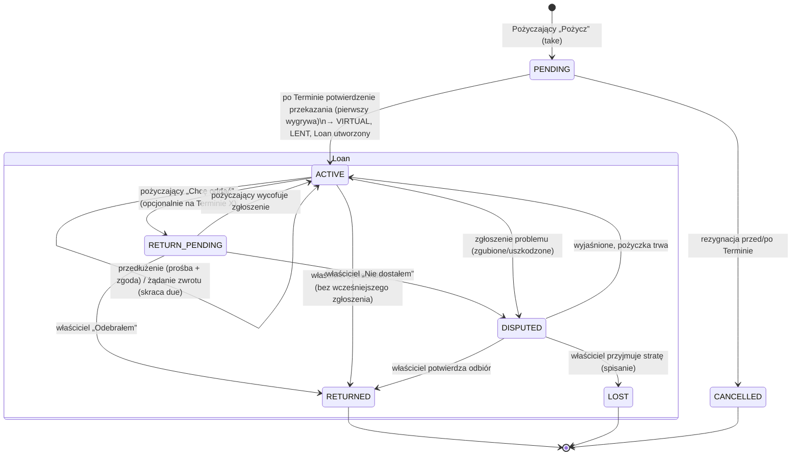

# Raport badawczy — cykl życia wypożyczenia (LEND) po przekazaniu rzeczy

**Typ badania:** mixed (techniczne + wymagania + literatura) · **Data:** 2026-09-25 ·
**Stan kodu:** HEAD `acd3b4c` · **Autor:** research-synthesizer (maister)

Ścieżki backendu są względne do `src/backend/`, frontendu do `src/frontend/src/`.
Skróty dokumentów:
- **INV**: `docs/system-wypozyczalni-inventory-accounting.md`
- **T14/T16/T17/T20**: wcześniejsze zadania development w `.maister/tasks/development/`
- **R02**: research party-archetype/Pledge

## Spis treści
1. Streszczenie
2. Cele i zakres
3. Metodologia
4. Stan obecny: co istnieje, czego brakuje, błędy
5. Proponowany model stanów i tabela zdarzeń
6. Wzorce zewnętrzne: przyjąć / zaadaptować / unikać
7. Otwarte decyzje produktowe
8. Ryzyka
9. Rekomendowane kolejne kroki
10. Odpowiedzi na pytania A1–A8, B1–B9, C1–C4
11. Załączniki: źródła, luki, poziomy pewności

---

## 1. Streszczenie

**Co badano.** Jak zaprojektować wypożyczenie rzeczy między rodzicami w Kręgu/Terminie tak,
żeby obejmowało cały czas trwania pożyczki: przekazanie, wirtualny magazyn pożyczającego, chęć
zwrotu, żądanie zwrotu przez właściciela, przedłużenie, termin zwrotu, przypomnienia, zaległość,
potwierdzenie odbioru, spory, zgubienie i anulowanie.

**Jak badano.** Przeczytałem kod backendu i frontendu (i sam sprawdziłem najważniejsze
twierdzenia w HEAD), dokument referencyjny INV i decyzje z wcześniejszych zadań. Przejrzałem też
ponad 20 źródeł zewnętrznych: biblioteki rzeczy, biblioteki narzędzi i zabawek, Lend Engine,
myTurn, Koha, Hygglo, Fat Llama, Olio, Buy Nothing, Peerby i Sharetribe.

**Najważniejsze ustalenia.**
1. **Pierwsza połowa cyklu działa**, druga praktycznie nie istnieje. Działa: oferta LEND →
   „Pożycz” (PENDING) → potwierdzenie po Terminie (pierwszy wygrywa) → rzecz w magazynie VIRTUAL
   pożyczającego (`home_inventory_id` = dom, balance `LENT`, `due_date` = teraz + 14 dni,
   +1 pkt dla właściciela). Nie istnieje: cały etap po przekazaniu.
2. **Zwrot jest dziś jednostronny i natychmiastowy.** Przycisk „Oddaję” tworzy RETURN,
   potwierdza go i realizuje w jednym kliknięciu, bez udziału właściciela
   (`PanelDataContext.tsx:1354-1380`). Łamie to regułę INV (zawsze pending → confirmed),
   decyzję T14 („no shortcuts”) i praktykę wszystkich zbadanych platform. Wszędzie tam pożyczkę
   zamyka właściciel lub obsługa.
3. **Kilka błędów trzeba naprawić przed nową funkcją.** Anulowanie RETURN psuje stan. `due_date`
   jest nadpisywany i nieegzekwowany. Surowe `/api/reservations*` przyjmują
   `reserved_by_user_id` z body. `confirm-transaction` ufa `term_id` z body. Właściciel nie
   widzi wypożyczonej rzeczy. Skan końca Terminu pomija LEND.
4. **Wybór magazynu (VIRTUAL czy „zostaje u właściciela” z polem holder) nie jest głównym
   problemem.** Głównym problemem jest brak jawnego nośnika stanu pożyczki. Dziś stan jest
   rozproszony na parę rezerwacji LEND/RETURN i jeden nadpisywany wiersz `InventoryBalance`.
   Nie ma historii ani powiązania LEND↔RETURN. Nie ma też miejsca na przedłużenie, żądanie
   zwrotu czy spór.
5. **Rekomendowany model** ma cztery elementy:
   - encja `Loan` w `app.circulation`, tworzona przy przekazaniu, ze statusami ACTIVE /
     RETURN_PENDING / RETURNED / DISPUTED / LOST;
   - wyliczane oznaczenia `overdue` i `due_soon`;
   - zwrot dwustronny, w którym pożyczający deklaruje, a właściciel potwierdza odbiór;
   - opcjonalne powiązanie zwrotu z przyszłym Terminem.
   Przypomnienia działają przez skan w stylu `term_end_scan`. Magazyn VIRTUAL zostaje, ale
   widoki właściciela uwzględniają `home_inventory_id`.

**Pewność ogólna:** wysoka dla inwentarza stanu obecnego i błędów, średnia dla proponowanego
modelu, bo zależy on od decyzji produktowych z §7.

---

## 2. Cele i zakres

**Pytanie główne:** jak zaprojektować pełny cykl życia LEND od oferty do zamknięcia?

**Pytania szczegółowe:** A1–A8 (stan obecny), B1–B9 (model cyklu życia), C1–C4 (wzorce
zewnętrzne). Odpowiedzi są w §10.

**W zakresie:**
- model stanów;
- zdarzenia po przekazaniu;
- miejsce i czas zwrotu;
- magazyny, balance i ledger;
- powiadomienia i UI;
- Pledge→LEND;
- `item_listing_preferences`.

**Poza zakresem:** implementacja, pieniądze, kaucje i ubezpieczenia, zmiany w GIFT/SWAP.

**Ograniczenia:**
- `app.groups` ↔ `app.circulation` komunikują się tylko przez `circulation_bridge`;
- obowiązują standardy `models.md` (StrEnum, BaseEntity, `lazy="raise"`, plain FK),
  `minimal-implementation.md` i `migrations.md`;
- projekt jest pre-prod, więc zmiany schematu nie wymagają shimów.

## 3. Metodologia

| Źródło | Zakres | Liczność |
|---|---|---|
| Kod BE | `app/circulation`, `app/groups`, notifications/outbox/APScheduler, authorization matrix, migracje 0030/0033/0034/0039, testy | ok. 25 plików, 15 błędów z plik:linia |
| Kod FE | panel („Wypożyczone”, „Moje rzeczy”, Home, modal globalny, dzwonek), Term page, klienci API, testy | ok. 20 plików |
| Dokumenty | INV (560 linii, całość), standardy, zadania T14/T16/T17/T20/R02/R23 | 8 zestawów dokumentów |
| Zewnętrzne | 12 źródeł pierwotnych pobranych, ok. 10 ze snippetów | 6 typów platform |

Framework: inwentarz komponentów → tabela przejść → przepływ danych → luki; macierz aktor ×
zdarzenie; tabela porównawcza wzorców; na końcu otwarte decyzje.

---

## 4. Stan obecny

### 4.1 Co istnieje (A1, A2)

| Element | Gdzie | Uwagi |
|---|---|---|
| `InventoryType.VIRTUAL` | `app/circulation/models.py:49-52` | magazyn pożyczającego, `get_or_create_virtual_inventory` (`application/inventory.py:73-77`), unikalność: migracja 0033 |
| `BalanceStatus` AVAILABLE/RESERVED/IN_TRANSIT/LENT/RETURNED | `models.py:63-68` | `RETURNED` nieużywany |
| `ReservationType` LEND/RETURN/SWAP/GIFT, `ReservationStatus` PENDING/CONFIRMED/CANCELLED/FULFILLED | `models.py:71-82` | brak stanów pożyczki |
| `InventoryItem.home_inventory_id` | `models.py:159-168`, migracja 0030 | ustawiany tylko w czasie pożyczki |
| `InventoryBalance.lent_at/returned_at/due_date` | `models.py:186-188` | relacja 1:1 z rzeczą, nadpisywane w każdym cyklu |
| `Reservation.giver_user_id`, `term_id` (NOT NULL) | `models.py:212-232`, migracje 0039 i 0034 | brak `paired_reservation_id` dla LEND↔RETURN |
| `_DEFAULT_LEND_DAYS = 14`, `_POSTED_AMOUNT = 1` | `domain/constants.py:9-10` | |
| Fulfil LEND: przeniesienie do VIRTUAL, LENT, due = `expires_at` lub teraz + 14 dni | `application/reservation_transitions.py:100-108` | `expires_at` nigdy nie jest podawany przez groups |
| Fulfil RETURN: powrót do domu, AVAILABLE | `reservation_transitions.py:109-117` | pomija RETURNED |
| Ledger: +1 dla bieżącego holdera | `reservation_transitions.py:128-132`, `infrastructure/ledger.py:62-98` | LEND daje punkt właścicielowi, RETURN pożyczającemu. Brak storna. |
| Take LEND → PENDING + powiadomienie `TERM_ITEM_LISTING_TAKEN` | `groups/application/term_item_listings.py:382-449` | |
| `confirm_transaction` / `cancel_transaction` po Terminie, pierwszy wygrywa | `term_item_listings.py:680-795` | |
| Preferencja LEND zachowana po fulfil (GIFT/SWAP ją kasują) | `term_item_listings.py:737-747` | brak testu dla LEND |
| Pledge→LEND do organizatora z auto-confirm | `groups/application/pledge_fulfillment.py:30-110` | fulfil przez surowy `/fulfill` |
| Właściciel edytuje i usuwa rzecz w czasie pożyczki, pożyczający dostaje 403 | `inventory_items.py:117-171` | |
| Scheduler: `scan_for_term_ended` co 1 min, outbox co 60 s | `app/main.py:46-73`, `outbox/scheduler.py:14-23` | precedens dla przypomnień |
| FE „Wypożyczone” (pożyczający): nazwa, „Od: X”, „Oddaj do: D”, przycisk „Oddaję” | `pages/panel/views/WypozyczoneView.tsx:4-46`, ładowanie `PanelDataContext.tsx:485-516` | |
| FE „Pożycz” na stronie Terminu | `pages/krag/hooks/useItemTake.ts:72-89`, `components/termLabels.ts:8-13` | |

### 4.2 Czego brakuje (luki względem pełnego cyklu)

1. Potwierdzenie odbioru zwrotu przez właściciela oraz „chęć zwrotu” jako osobny, oczekujący stan.
2. Żądanie zwrotu przez właściciela (recall).
3. Przedłużenie: prośba i akceptacja.
4. Przypomnienia o terminie i wykrywanie zaległości. Brak skanu i typów `NotificationKind`
   (`notifications/models.py:35-60`, `api/notifications.ts:3-16`).
5. Zwrot powiązany z przyszłym Terminem.
6. Spór, zgubienie, uszkodzenie: stany, wyniki i wpływ na ledger.
7. Anulowanie LEND przez groups przed Terminem (dziś możliwe tylko po Terminie).
8. Widok właściciela: „pożyczone: komu, do kiedy, czy po terminie”.
9. Zwrot dla Pledge-LEND u organizatora.
10. Historia pożyczek, bo balance jest nadpisywany.
11. Monit po Terminie dla LEND. Skan obsługuje tylko GIFT/SWAP (`term_end_scan.py:66-166`,
    filtr GIFT w liniach 72 i 88), więc **pożyczający nie dostaje żadnego monitu** o potwierdzenie
    przekazania. Działa tylko zapasowy kafelek właściciela „Odebrał”.
12. Po stronie pożyczającego brak widoku oczekujących wzięć. Toast obiecuje „Szczegóły w Twoim
    panelu” (`useItemTake.ts:82`), których tam nie ma.
13. Testy FE dla „Wypożyczone” i `returnBorrowedItem`: zero.

### 4.3 Błędy i niespójności

„Przed funkcją” oznacza, że błąd warto naprawić niezależnie od nowego projektu.

| # | Błąd | Dowód | Waga | Przed funkcją? |
|---|---|---|---|---|
| B1 | RETURN wykonywany jednostronnie przez pożyczającego (create + confirm + fulfil). Właściciel nie potwierdza odbioru, a pożyczający od razu dostaje +1 pkt. | `domain/reservation_rules.py:13-31`, `reservation_transitions.py:94,109-117`, FE `PanelDataContext.tsx:1354-1380`, test `tests/test_circulation.py:325-379` | Wysoka (produkt) | Naprawia go sama funkcja |
| B2 | **Anulowanie RETURN psuje stan.** Balance przechodzi na `AVAILABLE` i gubi `due_date`, a rzecz zostaje w VIRTUAL z ustawionym `home_inventory_id`. Rzecz trafia wtedy do przeglądania, a kolejny LEND nadpisze `home_inventory_id` identyfikatorem VIRTUAL pożyczającego, co zrywa powiązanie z domem. | `reservation_transitions.py:65-82` (warunkowo tylko `:76-78`), `:104` | Wysoka | **Tak** |
| B3 | `due_date` nadpisywany wartością `expires_at` (None) przy tworzeniu każdej rezerwacji, więc przy RETURN termin pożyczki znika | `application/reservations.py:97-99` | Średnia | **Tak** |
| B4 | `due_date` nieczytany przez żadną logikę. Liczony od kliknięcia fulfil, nie od Terminu. | grep, `reservation_transitions.py:108`, `infrastructure/circulation_bridge.py:73-97` | Średnia (luka) | W ramach funkcji |
| B5 | `RETURNED` nieużywany. Przepływ w kodzie różni się od INV (`lent → returned → available`). | `models.py:68`, INV:237-245, 512 | Niska | Decyzja D14 |
| B6 | **Surowe `/api/reservations*` omijają reguły groups.** `reserved_by_user_id` pochodzi z body i nie ma sprawdzenia aktora. Każdy użytkownik z EDIT może zablokować cudzą dostępną rzecz albo założyć RETURN cudzej pożyczki. Fulfil potwierdzonego LEND lub Pledge-LEND jest możliwy o dowolnej porze. | `circulation/router.py:161-223`, `reservations.py:60-103`, `core/authorization_matrix.py:159-160` | **Wysoka (bezpieczeństwo)** | **Tak** |
| B7 | `confirm_transaction` / `cancel_transaction` nie sprawdzają `reservation.term_id == term_id` z body. Dowolny miniony Termin odblokowuje akcję. | `term_item_listings.py:687-702`, `schemas.py:632-636` | Średnia | **Tak** |
| B8 | `term_id` dla RETURN = Termin LEND, który już minął, więc bramka po Terminie przechodzi zawsze | `reservations.py:26-46,76-77` | Średnia (projekt) | W ramach funkcji |
| B9 | Brak powiązania LEND↔RETURN (heurystyka „najnowszy FULFILLED LEND”). Brak historii cykli. | `reservations.py:26-46`, `models.py:171-188,233-239` | Średnia (model) | W ramach funkcji |
| B10 | **Właściciel nie widzi pożyczonej rzeczy** w „Moje rzeczy”, bo `/api/inventory-items/mine` bierze tylko PERSONAL po bieżącym `inventory_id`. Liczniki na Home też spadają. | `term_item_listings.py:137-168`, `circulation/infrastructure/repository.py:74-91`, FE `PanelDataContext.tsx:1048-1055` | Średnia | **Tak** |
| B11 | Po zwrocie ponownie wystawiona rzecz pokazuje `taken_by_party_id` = właściciel (RETURN) | `term_item_listings.py:180-212` | Niska / średnia | Tak (tanie) |
| B12 | Skan końca Terminu ignoruje LEND i Pledge-LEND, więc brak `TERM_CONFIRMATION_NEEDED`. Sprzeczne z T17 `spec.md:78`. | `term_end_scan.py:66-166`, `notifications/models.py:41` | Średnia | **Tak** |
| B13 | `cancel_transaction` działa dopiero po Terminie. Przed Terminem biorący nie może się wycofać przez groups. | `term_item_listings.py:689-690,770-795` | Niska | Decyzja D15 |
| B14 | Backfill 0039 przypisał historycznym LEND złego giver (pożyczającego) | `alembic/versions/0039_reservation_giver_user_id.py:9-13,41-51` | Niska (pre-prod) | Nie |
| B15 | Brak mechanizmu storna w ledgerze | `ledger.py:62-98` | Niska (luka) | Decyzja D13 |
| F1 | FE: błąd „Oddaję” wyświetla się na innej karcie (`itemError` tylko w `RzeczyView.tsx:385-387`). Brak blokady podwójnego kliknięcia. Trzy wywołania nieatomowe mogą zostawić wiszący RETURN. Cichy no-op przy `lenderUserId == null`. Brak `load({silent:true})`. | `WypozyczoneView.tsx:35-41`, `PanelDataContext.tsx:1354-1380` | Średnia | Zastąpione nowym UI |
| F2 | FE: etykiety z wymiany przy LEND („Anuluj wymianę”, „Potwierdź transakcję”). `toLocaleDateString` zamiast `utils/dayjs.ts`. Ręczne pobieranie danych (N+1: 3 żądania na rzecz) wbrew `data-fetching.md`. Nieaktualny test zgodności `NotificationKind`. | `RzeczyView.tsx:366`, `PanelDataContext.tsx:1557`, `WypozyczoneView.tsx:31`, `PanelDataContext.tsx:494-503`, `test/RzeczyViewCategory.test.tsx:451-467` | Niska | W ramach funkcji |
| DOC | INV nie zna VIRTUAL, a odstępstwo nie zostało zapisane. `architecture.md` pomija circulation, groups, notifications i outbox. `security.md` podaje złą ścieżkę do `AUTHORIZATION_MATRIX`. T17 opisuje LEND jako „ownership transfer”. | docs findings §2 i §4 | Niska | Przy okazji |

**Ostrzeżenie o błędach latentnych.** Gdy RETURN zacznie czekać na właściciela (PENDING lub
CONFIRMED), uaktywnią się trzy dziś uśpione błędy:
- `list_my_active_taken_term_item_listings` (`term_item_listings.py:316-340`) pokaże
  właścicielowi, że „bierze” własną rzecz;
- B3 zgubi termin zwrotu;
- `_require_holder_to_confirm` wymusi potwierdzenie przez pożyczającego.

Trzeba je obsłużyć razem z nową funkcją.

### 4.4 Magazyn VIRTUAL czy rzecz zostaje u właściciela (ocena neutralna)

Użytkownik wcześniej zdecydował, że przy utworzeniu relacji wypożyczenia powstaje magazyn VIRTUAL
pożyczającego. Kod już tak robi, ale **dopiero przy przekazaniu** (fulfil), a nie przy wzięciu.

| Kryterium | A. VIRTUAL + `home_inventory_id` (kod) | B. Rzecz zostaje u właściciela, balance `LENT` + `holder_user_id` (INV) | C. VIRTUAL + encja `Loan` |
|---|---|---|---|
| Zgodność z dokumentem referencyjnym | odstępstwo (niezapisane) | zgodna (INV:207-213, 505) | odstępstwo, ale jawne w ADR |
| Pytanie „u kogo fizycznie jest?” | naturalne (magazyn) | przez pole holder | naturalne |
| Pytanie „co jest moje?” (właściciel) | wymaga uwzględnienia `home_inventory_id` (dziś błąd B10) | trywialne | jak w A |
| Holder w regułach potwierdzania i ledgerze | działa bez zmian (`reservations.py:49-57`) | trzeba przepisać wyliczanie holdera, reguły i widok „Wypożyczone” | jak w A |
| Blokada podnajmu | gratis (tylko PERSONAL, właściciel = dom) | trzeba dopisać | gratis |
| Koszt zmiany | 0 | średni (fulfil, reguły, FE, rollback 0030, VIRTUAL zbędny) | niski do średniego (nowa tabela) |
| Historia i stan cyklu życia | brak | brak | jest |

**Wniosek.** A i B są równoważne co do możliwości. Żadne z nich nie rozwiązuje stanu cyklu
życia. B jest prostsze koncepcyjnie dla właściciela, ale A jest już zbudowane i daje holdera
gratis. **Rekomendacja: A lub C** (VIRTUAL zostaje, dochodzi `Loan`, patrz D1 i D3). Warunki:
naprawić B10, zapisać ADR odstępstwa od INV i zaktualizować INV. Pewność średnio-wysoka.

---

## 5. Proponowany model stanów i tabela zdarzeń

### 5.1 Nośnik stanu

Proponowana encja `Loan` w `app.circulation`. To nowa tabela `loans`, zgodna z `BaseEntity`.
Uzasadnienie z `models.md:9`: ma własną tożsamość i cykl życia.

| Pole | Znaczenie |
|---|---|
| `item_id` | rzecz |
| `lend_reservation_id`, `return_reservation_id` (null) | jawne powiązanie LEND↔RETURN, likwiduje heurystykę z B9 |
| `lender_user_id`, `borrower_user_id` | strony pożyczki |
| `lent_at`, `due_date`, `returned_at`, `closed_at` | daty cyklu |
| `status` (StrEnum) | `ACTIVE`, `RETURN_PENDING`, `RETURNED`, `DISPUTED`, `LOST` |
| `extension_count`, `requested_due_date` (null) | przedłużenia |
| `recalled_at` (null) | żądanie zwrotu przez właściciela |
| `dispute_reason` (null), `condition_note` (null) | spór i stan rzeczy |

`term_id` przekazania wystarczy wziąć z rezerwacji LEND. Termin zwrotu wystarczy wziąć z
rezerwacji RETURN.

**Wyliczane, nieprzechowywane:**
- `is_overdue = status in (ACTIVE, RETURN_PENDING) and now > due_date`
- `is_due_soon`

Wariant minimalny (bez `Loan`) opisuje D3.

`InventoryBalance` wraca do roli „stanu bieżącego rzeczy”:
- pożyczka trwa: `LENT`;
- zwrot zgłoszony: nadal `LENT` (nie `RESERVED`);
- odbiór potwierdzony: `AVAILABLE`.

`due_date` w balance można usunąć albo zostawić jako lustro. Źródłem prawdy jest `Loan.due_date`.

### 5.2 Diagram stanów

Przed przekazaniem żyje rezerwacja LEND. Po przekazaniu żyje `Loan`.

`overdue` / „po terminie” to flaga wyliczana dla ACTIVE i RETURN_PENDING, a nie stan.

### 5.3 Tabela zdarzeń

Skróty w tabeli: **P** = pożyczający, **W** = właściciel, **S** = system (scheduler),
**T** = Termin.

| # | Zdarzenie | Inicjuje | Potwierdza | Rezerwacja | Balance | Magazyn | Ledger | Powiadomienia | Czas względem Terminów |
|---|---|---|---|---|---|---|---|---|---|
| E1 | Oferta LEND (preferencja) | W | — | — | AVAILABLE | PERSONAL W | — | — | stała, działa na każdym T (jest) |
| E2 | „Pożycz” | P | — (W nie akceptuje, jak dziś) | LEND PENDING, `term_id` = T | RESERVED | bez zmian | — | W: `TERM_ITEM_LISTING_TAKEN` (jest). **Nowe:** pokazać P przewidywany termin zwrotu. | przed T lub w dniu T |
| E3 | Rezygnacja przed przekazaniem | P lub W | — | CANCELLED | AVAILABLE | bez zmian | — | druga strona: `LOAN_CANCELLED` (nowy) | przed T (nowe, D15) lub po T („Anuluj”, jest) |
| E4 | Monit po Terminie | S | — | — | — | — | — | obie strony: `TERM_CONFIRMATION_NEEDED` (**naprawić B12**) | T + skan |
| E5 | Potwierdzenie przekazania | P lub W (pierwszy wygrywa) | druga strona dostaje `TERM_ALREADY_RESOLVED` | LEND FULFILLED | LENT | rzecz → VIRTUAL P, `home_inventory_id` = PERSONAL W | +1 W | druga strona: `LOAN_STARTED` (nowy, z due) | po T (jest). **Nowe:** `Loan` ACTIVE, `due_date` wg D6. |
| E6 | Przypomnienie przed terminem | S | — | — | — | — | — | P (i W?): `LOAN_DUE_SOON` | np. 2 dni przed due lub przed ostatnim T przed due (D9) |
| E7 | Zaległość (flaga wyliczana) | S | — | — | LENT | — | — | P: `LOAN_OVERDUE` w dniu due, potem co 7 dni. W: informacja. | po due (D9, D10) |
| E8 | Żądanie zwrotu (recall) | W | — | — | — | — | — | P: `LOAN_RETURN_REQUESTED` | `due_date` := wskazana data lub najbliższy T (D8) |
| E9 | Prośba o przedłużenie | P | W | — | — | — | — | W: `LOAN_EXTENSION_REQUESTED` | `requested_due_date` |
| E10 | Zgoda lub odmowa przedłużenia (albo przedłużenie z inicjatywy W) | W | — | — | — | — | — | P: `LOAN_EXTENDED` / `LOAN_EXTENSION_DECLINED` | `due_date` := nowa data, `extension_count`+1 |
| E11 | „Chcę oddać” (deklaracja zwrotu) | P | — | RETURN PENDING (`reserved_by` = W, giver = P), `term_id` = wybrany **przyszły** T albo bez T (D5) | **LENT** (nie RESERVED, bez kasowania due, naprawa B3) | bez zmian | — | W: `LOAN_RETURN_PROPOSED` („odda na T X”) | przed wybranym T lub ad hoc |
| E12 | Wycofanie deklaracji | P | — | RETURN CANCELLED, `Loan` → ACTIVE | **LENT** (naprawa B2) | bez zmian | — | W: informacja | dowolnie |
| E13 | Monit po Terminie zwrotu | S | — | — | — | — | — | W: `RETURN_CONFIRMATION_NEEDED` („Czy X oddał Ci Y?”) | T zwrotu + skan, potem przypomnienia (D4) |
| E14 | „Odebrałem” (potwierdzenie odbioru) | **W** | — | RETURN (tworzony, jeśli nie było E11) → FULFILLED, `Loan` RETURNED | AVAILABLE, `returned_at` | rzecz → `home_inventory_id`, null | +1 P (holder przed przeniesieniem) | P: `LOAN_RETURNED`. Opcjonalnie `condition_note` / „uszkodzone” (D12). | dowolnie, także bez T. Preferencja LEND znów aktywna. |
| E15 | „Nie dostałem” | W | — | RETURN zostaje (lub CANCELLED), `Loan` DISPUTED | LENT | bez zmian (rzecz przypisana do P, jak „claimed returned”) | — | P: `LOAN_DISPUTED` | po E11/E13 |
| E16 | Zgłoszenie problemu (zgubione / uszkodzone / zniszczone) | P (lub W) | — | `Loan` DISPUTED + powód | LENT | bez zmian | — | druga strona: `LOAN_PROBLEM_REPORTED` | dowolnie |
| E17 | Rozstrzygnięcie: odnalezione lub wyjaśnione | W | — | `Loan` → ACTIVE lub → E14 | — | — | — | P | — |
| E18 | Rozstrzygnięcie: strata | W | — | `Loan` LOST (zamknięta), RETURN CANCELLED jeśli był | terminalny (np. soft-delete rzeczy, D11) | rzecz spisana z domu (VIRTUAL czyszczony) | brak +1 P. Bez storna +1 W (D13). | P: `LOAN_WRITTEN_OFF` | — |
| E19 | Pledge→LEND do organizatora | system (auto-confirm) | — | LEND jak dziś, fulfil przez groups (nie surowy) | jak E5 | VIRTUAL organizatora | +1 deklarujący | jak E5–E14, organizator = P | due domyślnie = dzień zajęć lub T (D16) |

**Autoryzacja (nowe reguły).**
- RETURN create lub confirm: tylko P.
- RETURN fulfil: **tylko W** (`reserved_by`).
- Recall, zgoda na przedłużenie, rozstrzygnięcie sporu: tylko W.
- Wszystko to przez nowe trasy groups lub circulation (np. `/api/loans/{id}/return`,
  `/confirm-return`, `/request-return`, `/extension-requests`, `/extend`, `/problem`,
  `/resolve`), zawsze z aktorem = principal, a nie z body. Liczba mnoga zgodnie z `api.md`.

**Granica DDD.**
- `Loan` i jego przejścia żyją w circulation. Circulation nie zna Terminów, ale przechowuje
  `term_id` jako plain FK, co jest już precedensem.
- Wybór przyszłego Terminu zwrotu, kwalifikowalność stron, powiadomienia i skan należą do
  groups (jak `term_item_listings`) i działają przez `circulation_bridge`.
- Naturalne miejsce na maszynę przejść to odłożony `circulation/domain/balance_state_machine.py`
  (lub `loan_rules.py`).

**Przypomnienia.**
- Nowy skan w groups na wzór `term_end_scan`: ograniczone zapytanie, marker idempotencji
  per (`loan_id`, `kind`, `due_date`) i wpis do outboxu w jednym commicie.
- Odczyt pożyczek zbliżających się do terminu lub po terminie przez bridge.
- Ujednolicić zegar: `utcnow` dla `due_date` kontra lokalny naiwny `occurs_on` (`term_end_scan.py:57-62`).

### 5.4 Widoki UI (skrót)

- **„Moje rzeczy” (W):** sekcja „Pożyczone innym” z polami: komu, od kiedy, do kiedy, znacznik
  „po terminie” i „zgłoszono zwrot na T X”. Akcje: „Odebrałem”, „Poproś o zwrot”, „Przedłuż”,
  „Nie dostałem” / „Zgubione”. Wymaga naprawy B10 (zapytanie po `home_inventory_id`).
- **„Wypożyczone” (P):** sekcja „Czekają na odbiór” (PENDING LEND z Terminem) i sekcja
  aktywnych pożyczek (odliczanie przez `utils/dayjs.ts`, kolor „po terminie”). Akcje:
  „Chcę oddać” (wybór T lub „oddałem już”), „Poproś o przedłużenie”, „Zgłoś problem”.
- **Modal globalny:** `TERM_CONFIRMATION_NEEDED` dla LEND oraz `RETURN_CONFIRMATION_NEEDED` dla W.
  Etykiety „wypożyczenie / zwrot” zamiast „wymiana / transakcja”.
- **Strona Terminu:** opcjonalny blok „Na tym Terminie oddajesz / odbierasz” (lista zwrotów
  zaplanowanych na T).
- **FE:** nowe hooki TanStack Query (`src/hooks/useLoans`) zgodnie z `data-fetching.md`, bez
  ręcznych fan-outów.

---

## 6. Wzorce zewnętrzne

| Wzorzec | Źródła | Werdykt dla Kręgu |
|---|---|---|
| Pożyczkę zamyka właściciel lub obsługa (check-in) | Hygglo „rental ends when the lender confirms”; Sharetribe (provider marks returned); Library of Things, Berkeley, Koha, Lend Engine (check-in) | **Przyjąć** (E14) |
| Auto-zamknięcie, gdy druga strona milczy | Sharetribe: auto-received po 14 dniach | **Zaadaptować ostrożnie** (D4). Rekomendacja: w MVP przypomnienia, bez auto-zamknięcia. |
| Termin zwrotu ustalany przy rezerwacji, 1–3 tygodnie | toy libraries 2–3 tyg., tool libraries 7 dni, Leila „ustalany per rzecz”, Olio „ustalany na czacie” | **Zaadaptować**: domyślny okres z datą widoczną przy „Pożycz”, edytowalny przez W (D6) |
| Przedłużenie z limitem i blokadą przy kolejce lub zaległości | LoT London, Leila (2x), Berkeley (2x), Koha (holds), Lend Engine, myTurn (min-%) | **Zaadaptować**: prośba P + zgoda W zamiast samoobsługi (brak obsługi), bez limitu (D7) |
| Przedłużenie jako nowa rezerwacja | Hygglo | **Unikać**, za ciężkie |
| Przypomnienie dzień wcześniej, potem cyklicznie | myTurn (dzień wcześniej, co tydzień), Lend Engine (co X dni), Koha (progi) | **Przyjąć** (E6, E7), tylko in-app (T16) |
| Zaległość wyliczana z `due_date` | Koha, Lend Engine, myTurn | **Przyjąć** |
| Zaległość → „lost” automatycznie po N dniach | Koha `longoverdue.pl` | **Unikać** w MVP. W małej grupie decyduje W. |
| Łagodne sankcje (blokada bez opłat) | Berkeley (fine-free od 2022) | **Opcja na później** (D10) |
| Opłaty, kaucje, ubezpieczenie, case manager | LoT, Fat Llama, Hygglo | **Unikać** (poza zakresem, grupa zaufania) |
| Recall skraca termin | Koha Recall | **Zaadaptować** (E8) |
| „Claimed returned” | Koha | **Zaadaptować** jako DISPUTED (E15) |
| Zgubione: zastąpienie podobną rzeczą lub spisanie | Leila, Olio, Koha | **Zaadaptować**: spisanie w systemie, zastąpienie poza systemem (D11) |
| Kontrola stanu i kompletności przy zwrocie | biblioteki zabawek (Rochester), Lend Engine (prompty), Hygglo/Olio/Fat Llama (zdjęcia) | **Zaadaptować jako opcjonalne**: notatka lub flaga „uszkodzone / niekompletne” przy E14 (D12) |
| Oceny i bramki zaufania | Olio (4★, 2 km), Leila (staż zwalnia z kaucji) | **Unikać**. Wystarczy widoczność historii. |
| Każde przejście ma jednego aktora, przejścia czasowe należą do systemu | Sharetribe transaction process | **Przyjąć** jako zasadę projektu (tabela §5.3) |

---

## 7. Otwarte decyzje produktowe

Każda decyzja ma opcje i rekomendację. Rekomendacje zakładają małą, zaufaną grupę bez pieniędzy.

**D1. Model magazynu w czasie pożyczki.**
Opcje: (a) VIRTUAL pożyczającego + `home_inventory_id` (kod); (b) rzecz zostaje w magazynie
właściciela, dochodzi `holder_user_id` (INV); (c) jak (a) + encja `Loan`.
**Rekomendacja: (a)/(c)** + naprawa B10 + ADR i aktualizacja INV.

**D2. Kiedy powstaje relacja i przeniesienie do VIRTUAL.**
Opcje: (a) przy „Pożycz” (PENDING); (b) przy potwierdzeniu przekazania po Terminie (kod).
**Rekomendacja: (b).** Przed Terminem rzecz fizycznie jest jeszcze u właściciela, a przy (a)
anulowanie musiałoby cofać przeniesienie.

**D3. Nośnik stanu pożyczki.**
Opcje: (a) nowa encja `Loan`; (b) para rezerwacji + kilka kolumn w balance (np.
`return_requested_at`, `extension_count`) + nowe statusy rezerwacji.
**Rekomendacja: (a)**, jeśli pierwsza wersja ma mieć przedłużenia, recall lub spory.
(b) wystarczy tylko wtedy, gdy MVP to wyłącznie zwrot dwustronny.

**D4. Kto zamyka zwrot i co, gdy właściciel milczy.**
Opcje: (a) tylko właściciel potwierdza, a przy milczeniu są przypomnienia; (b) jak (a) +
auto-zamknięcie po N dniach od deklaracji lub Terminu zwrotu; (c) jednostronnie pożyczający (dziś).
**Rekomendacja: (a)**. (b) rozważyć później, jeśli pożyczki będą „wisieć”.

**D5. Gdzie i kiedy następuje zwrot.**
Opcje: (a) zawsze na przyszłym Terminie Kręgu, potwierdzenie po nim; (b) ad hoc, poza Terminami;
(c) hybryda.
**Rekomendacja: (c).** Pożyczający może wskazać Termin („oddam na T X”, z monitem po nim), a
właściciel może potwierdzić odbiór w każdej chwili. Potwierdza tylko właściciel, więc bramka
czasowa jest zbędna.

**D6. Domyślny termin zwrotu.**
Opcje: (a) 14 dni od kliknięcia fulfil (dziś); (b) 14 dni od daty Terminu przekazania;
(c) „do następnego Terminu”; (d) ustala właściciel w ofercie; (e) wybiera pożyczający przy
„Pożycz”.
**Rekomendacja: (b)** z datą pokazaną przy „Pożycz” i możliwością zmiany przez właściciela.
(c) tylko wtedy, gdy Terminy są regularne. Pytanie zwrotne do użytkownika: jak często są Terminy?

**D7. Przedłużenie.**
Opcje: (a) prośba pożyczającego + zgoda właściciela; (b) samoobsługa z limitem (np. 2x);
(c) tylko właściciel może przedłużyć.
**Rekomendacja: (a)** + możliwość (c). Bez limitu, bo strażnikiem jest właściciel.

**D8. Żądanie zwrotu (recall).**
Opcje: (a) skraca `due_date` do wskazanej daty lub najbliższego Terminu + powiadomienie;
(b) tylko powiadomienie.
**Rekomendacja: (a).** Wtedy zaległość i przypomnienia działają automatycznie.

**D9. Harmonogram przypomnień.**
Opcje: różne offsety. Kanał in-app jest już przesądzony (T16).
**Rekomendacja:** 2 dni przed terminem, w dniu terminu, potem co 7 dni. Dodatkowo przypomnienie
w dniu Terminu Kręgu, jeśli termin zwrotu minął lub mija. Właściciel dostaje informację przy
pierwszej zaległości.

**D10. Sankcje za zaległość.**
Opcje: (a) brak, tylko oznaczenie „po terminie”; (b) blokada nowych wypożyczeń do zwrotu;
(c) widoczność zaległości dla organizatora.
**Rekomendacja: (a) w MVP.** (b) opcjonalnie później.

**D11. Zgubienie.**
Opcje: (a) właściciel przyjmuje stratę i rzecz jest spisywana (soft-delete lub status
terminalny); (b) własność przechodzi na pożyczającego; (c) zastąpienie podobną rzeczą rejestrowane
w systemie.
**Rekomendacja: (a)** + notatka. Zastąpienie odbywa się poza systemem, a właściciel może
dodać nową rzecz.

**D12. Uszkodzenie i kompletność.**
Opcje: (a) flaga lub notatka przy „Odebrałem” + aktualizacja `InventoryItem.condition`;
(b) osobny stan DAMAGED z procesem naprawy.
**Rekomendacja: (a).**

**D13. Punkty (ledger).**
Opcje: (a) +1 dla pożyczającego dopiero po potwierdzeniu odbioru przez właściciela; przy stracie
brak +1 i brak storna; (b) jak (a) + storno +1 właściciela przy stracie.
**Rekomendacja: (a)**, zgodnie z INV („nie storno”) i minimalizmem.

**D14. `BalanceStatus.RETURNED`.**
Opcje: (a) usunąć, a stan zwrotu trzymać w `Loan`; (b) użyć jako „zwrot zgłoszony, czeka na
odbiór”.
**Rekomendacja: (a)**, bo nazwa „RETURNED” sugeruje stan zakończony.

**D15. Anulowanie przed przekazaniem.**
Opcje: (a) obie strony mogą anulować PENDING LEND także przed Terminem (przez groups);
(b) tylko po Terminie (dziś).
**Rekomendacja: (a).** Po przekazaniu nie ma anulowania, jest tylko zwrot.

**D16. Pledge→LEND do organizatora.**
Opcje: (a) ten sam mechanizm `Loan`, z terminem zwrotu domyślnie w dniu zajęć lub Terminu;
(b) deklarujący wybiera przy deklaracji „oddaję na stałe” (GIFT) albo „pożyczam” (LEND);
(c) bez zwrotu.
**Rekomendacja: (a) + (b).** To zamyka pytanie otwarte z R02.

**D17. Rola organizatora Kręgu w sporach.**
Opcje: (a) brak, strony rozstrzygają same, a decyzję podejmuje właściciel; (b) organizator widzi
spory tylko do odczytu; (c) organizator może rozstrzygać.
**Rekomendacja: (a) w MVP**, (b) później.

**D18. Zakres pierwszej wersji.**
Opcje:
- (a) naprawy błędów + zwrot dwustronny + widok właściciela + termin zwrotu i przypomnienia;
- (b) jak (a) + przedłużenie i recall;
- (c) pełny zakres ze sporami.
**Rekomendacja: (b)**, a spory i stratę dodać w drugiej iteracji. D3 wybrać z wyprzedzeniem,
żeby uniknąć migracji podwójnej.

---

## 8. Ryzyka

| Ryzyko | Prawdopodobieństwo | Wpływ | Mitygacja |
|---|---|---|---|
| Uaktywnienie latentnych błędów przy oczekującym RETURN (§4.3) | Wysokie | Średni | Naprawić B3, B11 i `list_my_active_taken_…` w tym samym zakresie. Dodać testy. |
| Pożyczki „wiszą”, bo właściciel nie potwierdza odbioru | Średnie | Średni | Monit po Terminie zwrotu i przypomnienia. Auto-zamknięcie jako opcja (D4). |
| Surowe `/api/reservations*` nadal pozwalają obejść nowy cykl (B6) | Wysokie (gdy nie naprawione) | Wysoki | Aktor = principal, reguły per typ. Ewentualnie wycofać zapis przez surowe trasy z FE lub z macierzy. |
| Wyścigi, np. recall właściciela w trakcie deklaracji zwrotu | Niskie | Niski | `version_id_col` (`updated_at`), przejścia z warunkiem statusu. |
| Rozjazd zegarów UTC i czasu lokalnego w przypomnieniach „dziś / jutro” | Średnie | Niski | Jedna konwencja w skanie, testy granic. |
| Przerost (spory, sankcje) wbrew `minimal-implementation` | Średnie | Średni | Etapowanie D18. |
| Migracja podwójna przy zmianie D3 z (b) na (a) | Średnie | Niski (pre-prod) | Decyzję D3 podjąć przed startem. |
| Dane lokalne z błędnym backfillem 0039 mylą testy ręczne | Średnie | Niski | Wyczyścić lokalne dane (i tak są śmieciowe). |

---

## 9. Rekomendowane kolejne kroki

**Krok 0: poprawki niezależne od funkcji.** Najlepiej jako `/maister:quick-bugfix` lub osobny
development.
1. **B6:** `POST /api/reservations` przyjmuje `reserved_by` = principal (lub tylko dopuszczone
   przypadki). Reguły per typ dla confirm, cancel i fulfil. Rozważyć usunięcie zależności FE od
   surowych tras.
2. **B7:** w `confirm_transaction` i `cancel_transaction` sprawdzać
   `reservation.term_id == term_id`, a najlepiej brać Termin z rezerwacji.
3. **B2:** anulowanie RETURN przywraca `LENT` i zachowuje `due_date`.
4. **B3:** `create_reservation` nie nadpisuje `due_date` przy RETURN i nie kopiuje `expires_at`
   do `due_date`.
5. **B10:** `/api/inventory-items/mine` zwraca też rzeczy z `home_inventory_id` = PERSONAL
   (z polem „pożyczone: komu, do kiedy”).
6. **B12:** `term_end_scan` emituje `TERM_CONFIRMATION_NEEDED` dla PENDING LEND (w tym
   Pledge-LEND).
7. **B11:** `_resolve_listing_status` ignoruje RETURN.
8. Testy: zachowanie preferencji po LEND, anulowanie RETURN, lista „mine” z pożyczonymi.

**Krok 1:** podjąć decyzje D1–D18 (szczególnie D3, D4, D5, D6, D18) i zapisać ADR odstępstwa od
INV (VIRTUAL). Zaktualizować INV, `architecture.md` i ścieżkę w `security.md`.

**Krok 2:** `/maister:development` dla „Zwrot dwustronny + widok właściciela + termin i
przypomnienia”. Zakres:
- encja `Loan` (jeśli D3a) i migracja;
- nowe typy `NotificationKind`;
- skan pożyczek;
- nowe trasy;
- FE: hooki TanStack Query, sekcja „Pożyczone innym”, nowy „Wypożyczone”, modal.

**Krok 3:** przedłużenie i recall (jeśli nie weszły w kroku 2), potem spór, strata i uszkodzenie.

**Krok 4:** propozycja standardu (do zatwierdzenia przez użytkownika przez
`/maister:standards-update`): „stan wyliczalny z czasu (overdue, due_soon) nie jest
przechowywany”. Formalizuje on precedens z T14 i założenie z briefu.

---

## 10. Odpowiedzi na pytania szczegółowe

**A. Stan obecny**
- **A1 (ścieżki kodu):** §4.1. `RETURNED` jest martwy. `due_date` nie jest egzekwowany.
  `_resolve_return_term_id` bierze Termin z ostatniego LEND.
- **A2 (tworzenie LEND):** z Terminu: take → PENDING → `confirm_transaction` po Terminie (confirm
  + fulfil). Z Pledge: auto-confirm → IN_TRANSIT → fulfil przez surowy `/fulfill`. W obu
  przypadkach termin zwrotu to 14 dni od fulfil.
- **A3 (RETURN):** jednostronny, trzy surowe wywołania z FE. Endpointy wymagają tylko EDIT, a
  reszta sprawdzeń jest w serwisie (B1, B6).
- **A4 (ledger):** +1 dla właściciela przy LEND, +1 dla oddającego przy RETURN. Zgodne z INV
  KROK 4/5. Brak storna. Przepływ statusów odbiega od INV (B5).
- **A5 (powiadomienia i scheduler):** APScheduler z `term_end_scan` (tylko GIFT/SWAP) i outbox.
  Brak typów dla LEND i RETURN. Wzorzec skan + marker + outbox nadaje się do przypomnień.
- **A6 (zmiany w HEAD):** `giver_user_id` utrzymuje obie strony pożyczki jako uczestników.
  Backfill 0039 jest błędny dla aktualnie wypożyczonych rzeczy (B14). `/inventory-items/mine`
  ukrywa pożyczone (B10). `ReservationResponse` nie eksponuje `giver_user_id`.
- **A7 (FE):** tabela §5 w findings FE. Właściciel nie widzi nic, pożyczający widzi rzecz
  dopiero po fulfil. Termin zwrotu jest tylko wyświetlany.
- **A8 (preferencje):** LEND zachowuje preferencję. W czasie pożyczki rzecz jest ukryta
  w przeglądaniu. Po zwrocie wraca automatycznie. Status oferty po zwrocie jest błędny (B11).
  Pożyczający nie może wystawić pożyczonej rzeczy.

**B. Model cyklu życia**
- **B1 (stany):** przechowywane: LEND PENDING/CONFIRMED/CANCELLED/FULFILLED oraz `Loan`
  ACTIVE / RETURN_PENDING / RETURNED / DISPUTED / LOST. Wyliczane: overdue, due_soon (§5.2).
- **B2 (kto inicjuje i potwierdza):** tabela §5.3. Dwustronne są przekazanie i zwrot, zwrot
  zamyka właściciel.
- **B3 (miejsce zwrotu):** hybryda (D5). RETURN niesie przyszły `term_id` albo żaden,
  potwierdza właściciel.
- **B4 (przedłużenie i termin):** D6, D7. Prośba + zgoda, domyślnie 14 dni od daty Terminu.
- **B5 (przypomnienia i zaległość):** D9, D10, tylko in-app, łagodnie.
- **B6 (spory):** DISPUTED w stylu „claimed returned”. Wyniki: RETURNED, ACTIVE lub LOST.
  Bez storna (D11–D13).
- **B7 (anulowanie):** przed przekazaniem obie strony. Po przekazaniu tylko zwrot (D15).
- **B8 (Pledge→LEND):** ten sam mechanizm, termin zwrotu = dzień zajęć (D16).
- **B9 (agregat):** `Loan` jako agregat w circulation. Kontekst Terminu (wybór Terminu zwrotu,
  kwalifikowalność, powiadomienia) w groups przez bridge (D3).

**C. Wzorce zewnętrzne:** §6. C1: biblioteki rzeczy, narzędzi i zabawek, Lend Engine, myTurn.
C2: Hygglo, Fat Llama, Olio, Buy Nothing, Peerby. C3: Koha (renewals, holds, recall, claims
returned, longoverdue). C4: Sharetribe (maszyna stanów z aktorami), zaległość wyliczana,
kontrola stanu na obu końcach.

---

## 11. Załączniki

### 11.1 Źródła
- Findings: `analysis/findings/codebase-backend-lend-lifecycle.md`,
  `codebase-frontend-lend-lifecycle.md`, `docs-lend-lifecycle.md`, `external-lend-lifecycle.md`.
- Synteza: `analysis/synthesis.md`.
- Kod (główne): `app/circulation/{models.py, application/reservations.py,
  application/reservation_transitions.py, application/inventory_items.py, domain/reservation_rules.py,
  infrastructure/ledger.py, router.py}`, `app/groups/application/{term_item_listings.py,
  pledge_fulfillment.py, term_end_scan.py}`, `app/groups/infrastructure/circulation_bridge.py`,
  `app/notifications/models.py`, `app/core/authorization_matrix.py`; FE `pages/panel/{PanelDataContext.tsx,
  views/WypozyczoneView.tsx, views/RzeczyView.tsx, views/HomeView.tsx}`, `pages/krag/hooks/useItemTake.ts`.
- Dokumenty: INV; T14, T16, T17, T20, R02, R23; standardy `models.md`, `minimal-implementation.md`,
  `migrations.md`, `security.md`, `data-fetching.md`.
- Zewnętrzne (wybór): libraryofthings.co.uk/terms-of-borrowing; leila-berlin.de/leihregeln;
  berkeleypubliclibrary.org (tool lending); lend-engine.com/features; support.myturn.com;
  koha-community.org/manual (circulation, cron jobs); help.hygglo.info (how Hygglo works, claims);
  fatllama.crisp.help; help.olioapp.com; docs.buynothingproject.org;
  sharetribe.com/docs/concepts/transactions.

### 11.2 Luki i niepewności
- Nie wiadomo, jak często odbywają się Terminy. To wpływa na D5 i D6.
- Nie wiadomo, jaką rolę ma mieć organizator (D17).
- B2 i B11 potwierdzono analizą kodu, nie uruchomieniem.
- Twierdzenia o Peerby, Fat Llama i myTurn pochodzą ze snippetów (średnia pewność), ale każdy
  przyjęty wzorzec ma co najmniej dwa źródła wysokiej pewności.
- Nie sprawdzono wydajności (N+1 w FE jest znane, BE nie było profilowane).

### 11.3 Poziomy pewności
| Obszar | Pewność |
|---|---|
| Inwentarz stanu obecnego (§4.1–4.2) | Wysoka |
| Błędy B1–B4, B6–B10, B12 | Wysoka (kluczowe potwierdzone odczytem kodu) |
| B2 (skutki), B11 (wpływ na UI) | Średnio-wysoka / średnia |
| Ocena VIRTUAL vs holder (§4.4) | Średnio-wysoka |
| Proponowany model (§5) | Średnia (zależy od D1–D18) |
| Wzorce zewnętrzne (§6) | Wysoka dla Hygglo, Koha, LoT, Leila, Berkeley, Sharetribe, Lend Engine; średnia dla reszty |
