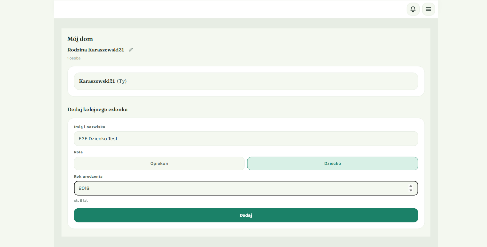
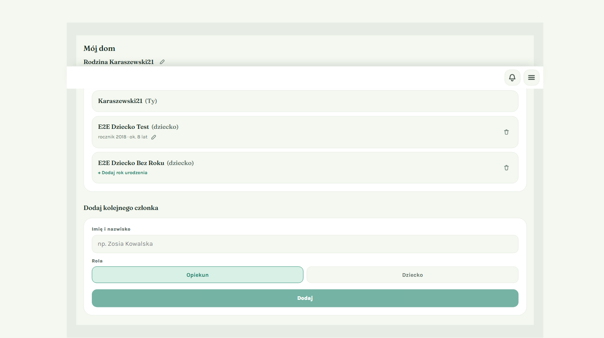
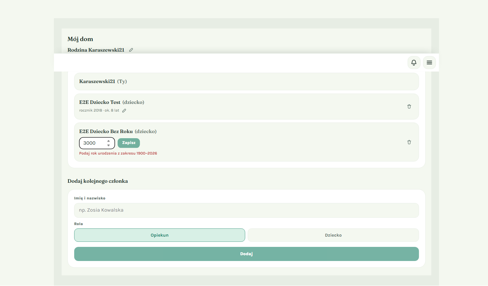
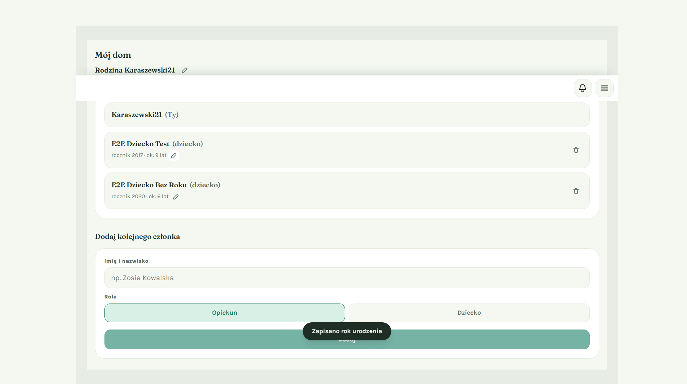
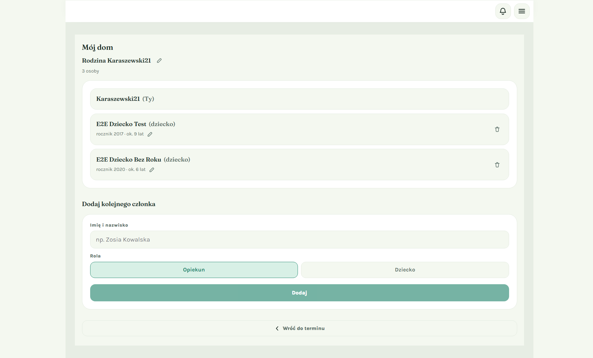
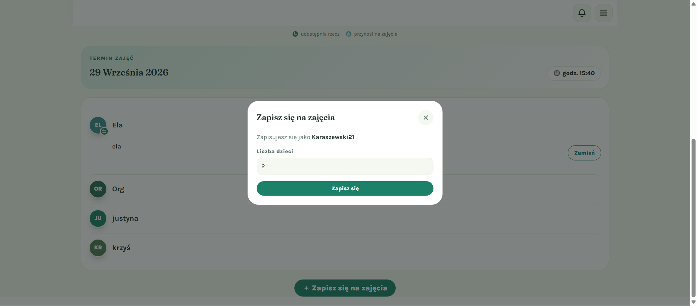
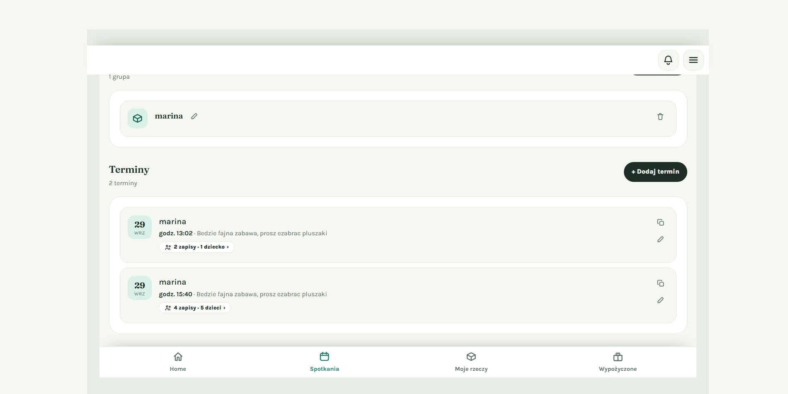
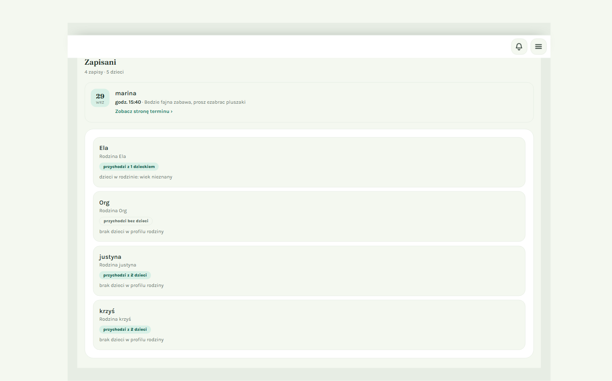
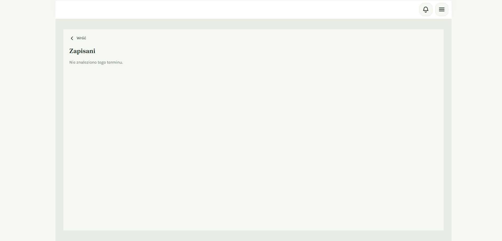

# Rodzina i zapisy na zajęcia – przewodnik

*Ostatnia aktualizacja: 1 października 2026*

Ten przewodnik ma dwie części:

- **Dla rodzica / opiekuna** – jak uzupełnić „Mój dom” (dzieci i ich rok urodzenia) i wrócić do zapisu na zajęcia.
- **Dla organizatora** – jak sprawdzić, kto zapisał się na termin i z iloma dziećmi przyjdzie.

## Spis treści

1. [Dla rodzica: uzupełnij rodzinę przy zapisie](#1-dla-rodzica-uzupełnij-rodzinę-przy-zapisie)
2. [Dla rodzica: dodaj dziecko](#2-dla-rodzica-dodaj-dziecko)
3. [Dla rodzica: zmień rok urodzenia dziecka](#3-dla-rodzica-zmień-rok-urodzenia-dziecka)
4. [Dla rodzica: wróć do terminu i zapisz się](#4-dla-rodzica-wróć-do-terminu-i-zapisz-się)
5. [Dla organizatora: kto się zapisał?](#5-dla-organizatora-kto-się-zapisał)
6. [Najczęstsze pytania](#6-najczęstsze-pytania)

---

## 1. Dla rodzica: uzupełnij rodzinę przy zapisie

Jeśli w „Moim domu” nie masz jeszcze dodanych dzieci, okno **„Zapisz się na zajęcia”** wyświetli ramkę:

> **Dodaj rodzinę, aby uzupełnić liczbę dzieci**
> Liczbę dzieci uzupełnimy automatycznie z Twojego domu.
> [ Przejdź do „Mój dom” ]  [ Pomiń ]

- Kliknij **Przejdź do „Mój dom”**, aby dodać dzieci. Aplikacja zapamięta, z którego terminu przyszedłeś.
- Kliknij **Pomiń**, jeśli wolisz od razu wpisać liczbę dzieci ręcznie.

💡 **Wskazówka**: Dzieci wystarczy dodać raz. Przy kolejnych zapisach liczba dzieci wpisze się sama.

---

## 2. Dla rodzica: dodaj dziecko

Strona **„Mój dom”** (menu → Mój dom) pokazuje wszystkie osoby w Twojej rodzinie. Obok imienia widać, kim jest dana osoba:

| Oznaczenie | Znaczenie |
|---|---|
| **(Ty)** | Ty, czyli osoba zalogowana |
| **(opiekun)** | inny dorosły w rodzinie, np. drugi rodzic |
| **(dziecko)** | dziecko |

**Kroki:**

1. W sekcji **„Dodaj kolejnego członka”** wpisz imię i nazwisko, np. *Zosia Kowalska*.
2. W polu **Rola** kliknij **Dziecko**. Pojawi się pole **Rok urodzenia**.
3. Wpisz rok urodzenia, np. *2018*. Pod polem zobaczysz przybliżony wiek („ok. 8 lat”).
4. Kliknij **Dodaj**.

   

✅ **Co zobaczysz**: dziecko pojawi się na liście z dopiskiem **(dziecko)** i z rocznikiem, np. „rocznik 2018 · ok. 8 lat”.

📝 **Warto wiedzieć**:
- Rok urodzenia jest **nieobowiązkowy** i dotyczy tylko dzieci. Przy roli „Opiekun” to pole się nie pokazuje.
- Rok musi mieścić się w zakresie od 1900 do bieżącego roku. Jeśli wpiszesz inny, zobaczysz czerwony komunikat, a przycisk **Dodaj** będzie nieaktywny.

---

## 3. Dla rodzica: zmień rok urodzenia dziecka

Rocznik możesz dodać lub poprawić w każdej chwili, bezpośrednio na liście.

1. Przy dziecku:
   - jeśli ma już rocznik, kliknij **ołówek** obok napisu „rocznik …”,
   - jeśli nie ma, kliknij **+ Dodaj rok urodzenia**.
2. Wpisz rok i kliknij **Zapisz** albo naciśnij **Enter**.
   Aby zrezygnować, naciśnij **Esc**.

   

   ⚠️ Gdy rok jest spoza zakresu (np. 3000), zobaczysz komunikat „Podaj rok urodzenia z zakresu 1900–2026”, a przycisk **Zapisz** będzie nieaktywny.

✅ **Co zobaczysz**: na dole ekranu na chwilę pojawi się komunikat **„Zapisano rok urodzenia”**, a przy dziecku zaktualizuje się rocznik.

---

## 4. Dla rodzica: wróć do terminu i zapisz się

Jeśli do „Mojego domu” przyszedłeś z okna zapisu, na dole strony zobaczysz przycisk **„Wróć do terminu”**.

1. Kliknij **Wróć do terminu**. Wrócisz na stronę tego samego terminu.
2. Kliknij **＋ Zapisz się na zajęcia**.
3. Pole **Liczba dzieci** jest już wypełnione na podstawie „Mojego domu”. Możesz je zmienić, jeśli tym razem przyjdziesz z mniejszą liczbą dzieci.
4. Kliknij **Zapisz się**.

   

💡 **Wskazówka**: Jeśli wejdziesz do „Mojego domu” zwyczajnie z menu, przycisk „Wróć do terminu” się nie pokaże. To normalne.

---

## 5. Dla organizatora: kto się zapisał?

### Podsumowanie na karcie terminu

Na stronie głównej panelu i w zakładce **Spotkania** każda karta Twojego terminu ma znaczek z podsumowaniem, np.:

- **„4 zapisy · 5 dzieci ›”** – 4 osoby się zapisały i łącznie przyprowadzą 5 dzieci,
- **„Brak zapisów”** – nikt jeszcze się nie zapisał.

Kliknij znaczek, aby otworzyć listę zapisanych.

### Strona „Zapisani”

Na górze zobaczysz podsumowanie, kartę terminu (data, grupa, godzina) i link **„Zobacz stronę terminu ›”**. Niżej znajduje się lista zapisanych osób. Każda pozycja pokazuje:

- **imię osoby i nazwę jej rodziny**, np. „Ela – Rodzina Ela”,
- **ile dzieci przyprowadzi**, np. „przychodzi z 1 dzieckiem”, „przychodzi z 2 dzieci” albo „przychodzi bez dzieci”,
- **wiek dzieci w tej rodzinie**, np. „dzieci w rodzinie: 5, 8 lat”.
  - „wiek nieznany” oznacza, że rodzic nie podał rocznika dziecka.
  - „brak dzieci w profilu rodziny” oznacza, że rodzina nie dodała dzieci w „Moim domu”.

🔒 **Prywatność**: imiona dzieci **nigdy** nie są pokazywane, widać tylko ich wiek. Dzięki temu możesz dopasować zajęcia do wieku dzieci, nie poznając danych o dzieciach z innych rodzin.

Kliknij **Wróć**, aby wrócić do zakładki Spotkania.

### Inne komunikaty na stronie „Zapisani”

| Komunikat | Co oznacza |
|---|---|
| **„Nikt jeszcze nie zapisał się na ten termin.”** | Termin nie ma jeszcze żadnych zapisów. |
| **„Nie masz dostępu do tego terminu.”** | Ta lista jest tylko dla organizatora grupy. Inni użytkownicy jej nie widzą. |
| **„Nie znaleziono tego terminu.”** | Termin nie istnieje albo został usunięty. Sprawdź link. |
| Przycisk **„Spróbuj ponownie”** | Wystąpił chwilowy problem z wczytaniem. Kliknij przycisk, aby spróbować jeszcze raz. |

---

## 6. Najczęstsze pytania

**Nie widzę pola „Rok urodzenia”.**
Upewnij się, że w polu **Rola** wybrano **Dziecko**. Dla opiekunów rocznika się nie podaje.

**Przy zapisie nie widzę ramki „Dodaj rodzinę…”.**
Ramka pojawia się tylko wtedy, gdy w „Moim domu” nie ma jeszcze dzieci. Jeśli dzieci już są, liczba dzieci wpisuje się sama.

**Organizator widzi „wiek nieznany” przy moich dzieciach.**
Dodaj rocznik w „Moim domu”: kliknij **+ Dodaj rok urodzenia** przy dziecku (zobacz punkt 3).

**Czy organizator zobaczy imiona moich dzieci?**
Nie. Organizator widzi tylko liczbę dzieci i ich wiek.

**Jako organizator nie widzę znaczka z zapisami.**
Znaczek pokazuje się tylko na kartach terminów w grupach, które organizujesz.
