# Sprawdzanie treści (moderacja) — przewodnik

*Ostatnia aktualizacja: 5 października 2026*

Dbamy o to, żeby nazwy, opisy i zdjęcia w aplikacji były bezpieczne i przyjazne dla wszystkich. Część z nich jest automatycznie sprawdzana. Ten przewodnik wyjaśnia, co jest sprawdzane, co zobaczysz, gdy coś zostanie zatrzymane, i co wtedy zrobić.

**Spis treści**

1. [Teksty: nazwy i opisy](#1-teksty-nazwy-i-opisy)
2. [Zdjęcia rzeczy](#2-zdjęcia-rzeczy)
3. [Dla administratorów: kolejka zdjęć](#3-dla-administratorów-kolejka-zdjęć)
4. [Najczęstsze pytania](#4-najczęstsze-pytania)

---

## 1. Teksty: nazwy i opisy

### Co jest sprawdzane?

W chwili zapisywania sprawdzamy:

- **nazwę organizacji**,
- **nazwę grupy**,
- **opis terminu**,
- **nazwę i opis rzeczy** (także nazwy rzeczy dodawanych do listy „Potrzebne rzeczy” w terminie).

Tekst jest sprawdzany **tylko wtedy, gdy go zmienisz**. Jeśli edytujesz na przykład tylko datę terminu, jego opis nie jest ponownie sprawdzany.

💡 **Dobra wiadomość:** sprawdzenie trwa chwilę i dzieje się od razu. Gdy tekst zostanie zapisany, od razu widzą go inni. Nie ma żadnego oczekiwania na akceptację.

### Co zobaczysz, gdy tekst zostanie odrzucony?

Jeśli tekst narusza zasady społeczności, **nic nie zostanie zapisane**. Nad przyciskiem zapisu pojawi się czerwony komunikat, który mówi, którego pola dotyczy problem. Wpisany tekst zostaje w formularzu, więc nie musisz zaczynać od nowa.

Przykład dla nazwy organizacji (strona „Moja organizacja”):

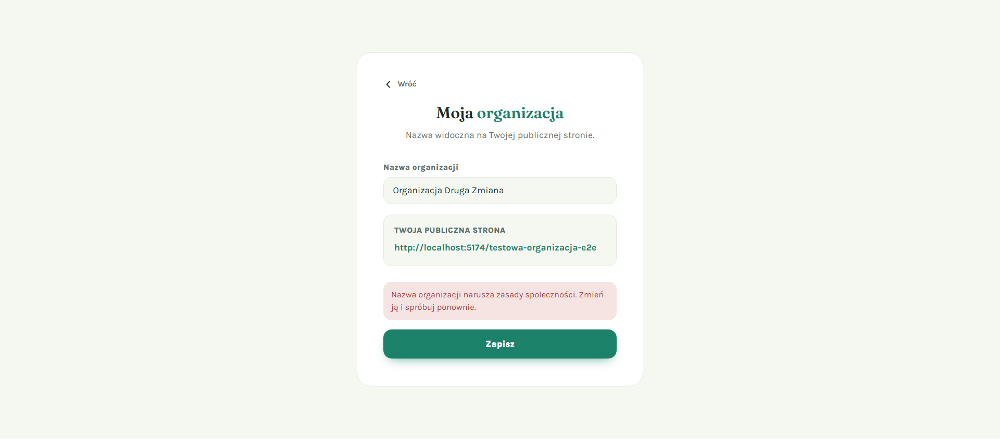

Przykład dla nazwy grupy (okno „Dodaj nową grupę”):

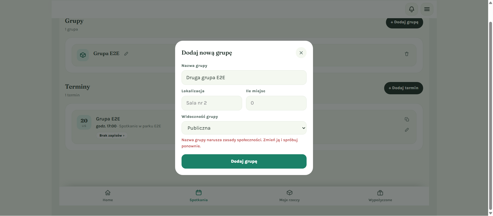

Przykład dla opisu terminu (okno „Dodaj termin”):

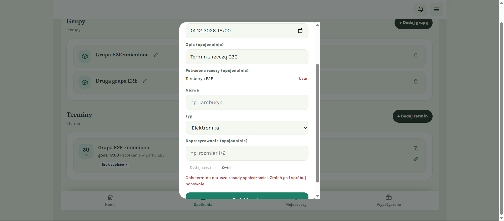

Możliwe komunikaty:

| Pole | Komunikat |
|---|---|
| Nazwa organizacji | Nazwa organizacji narusza zasady społeczności. Zmień ją i spróbuj ponownie. |
| Nazwa grupy | Nazwa grupy narusza zasady społeczności. Zmień ją i spróbuj ponownie. |
| Opis terminu | Opis terminu narusza zasady społeczności. Zmień go i spróbuj ponownie. |
| Nazwa rzeczy | Nazwa rzeczy narusza zasady społeczności. Zmień ją i spróbuj ponownie. |
| Opis rzeczy | Opis rzeczy narusza zasady społeczności. Zmień go i spróbuj ponownie. |

### Co zrobić?

1. **Przeczytaj komunikat** — mówi, które pole trzeba poprawić.
2. **Zmień tekst** w tym polu. Usuń wulgaryzmy, obraźliwe słowa lub treści, które mogą kogoś urazić.
3. **Kliknij ponownie przycisk zapisu** (np. „Zapisz”, „Dodaj grupę”, „Dodaj termin”).

✅ **Co powinno się stać:** formularz zapisze się normalnie, a komunikat zniknie.

⚠️ Przy dodawaniu terminu z listą „Potrzebne rzeczy”: jeśli któraś nazwa rzeczy zostanie odrzucona, termin **nie** zostanie utworzony. Popraw nazwę i kliknij „Dodaj termin” jeszcze raz — nie powstanie żaden duplikat.

### Dane kontaktowe są niedozwolone

W nazwie i opisie rzeczy nie można podawać **numeru telefonu, adresu e-mail, linków ani nazw komunikatorów**. Ten błąd wygląda tak samo — czerwony komunikat przy formularzu, nic nie zostaje zapisane:

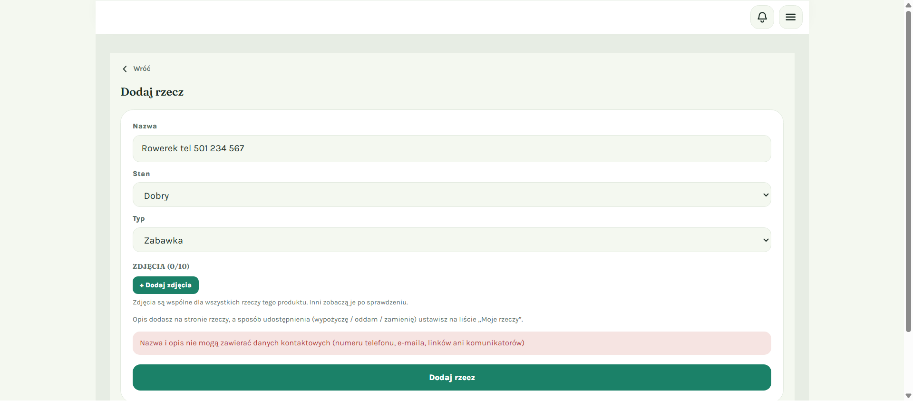

To samo zobaczysz podczas edycji opisu rzeczy:

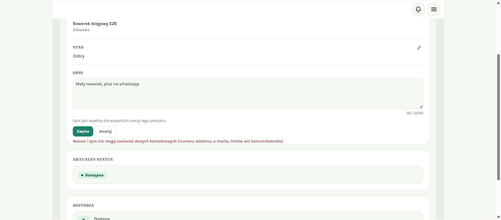

💡 **Dlaczego?** Kontakt odbywa się w aplikacji. Dzięki temu Twoje dane prywatne nie trafiają do obcych osób.

### „Moderacja jest chwilowo niedostępna”

Czasem zamiast odrzucenia zobaczysz komunikat:

> **Moderacja jest chwilowo niedostępna — spróbuj za chwilę.**

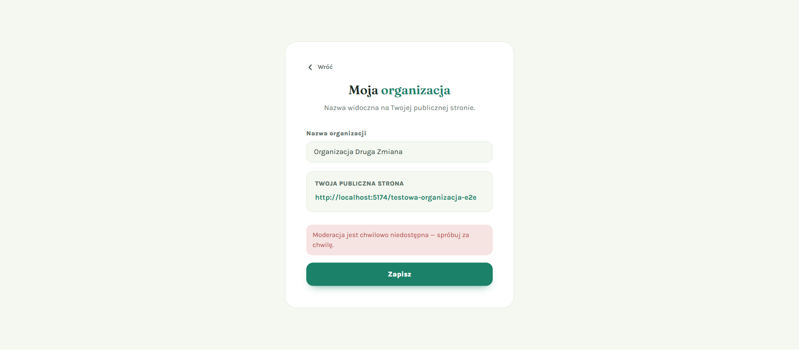

To **nie** znaczy, że Twój tekst jest niewłaściwy. Po prostu nie udało się go teraz sprawdzić.

- ⚠️ **Nic nie zostało zapisane.**
- Twój tekst nadal jest w formularzu.
- Odczekaj chwilę i **kliknij przycisk zapisu ponownie**.

Jeśli komunikat pojawia się dłużej niż kilkanaście minut, skontaktuj się z administratorem.

---

## 2. Zdjęcia rzeczy

### Co dzieje się po dodaniu zdjęcia?

Każde nowe zdjęcie rzeczy jest automatycznie sprawdzane. Trwa to zwykle chwilę, ale może potrwać dłużej.

Dopóki zdjęcie nie zostanie sprawdzone:

- **Ty** widzisz je z oznaczeniem **„W moderacji”** w lewym górnym rogu,
- **inni** go jeszcze nie widzą.

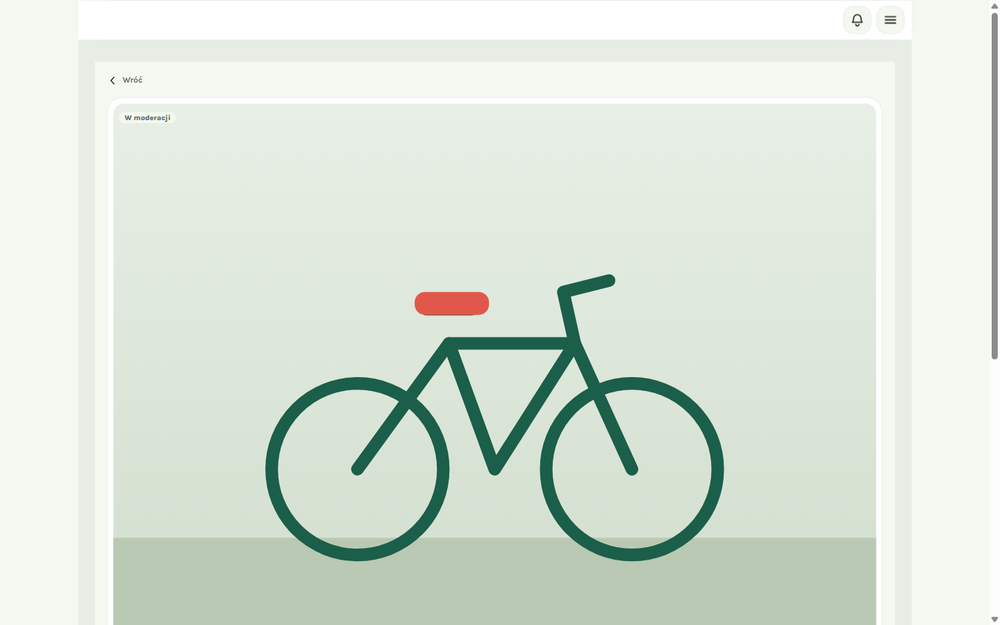

💡 **Nie musisz odświeżać strony.** Gdy masz otwartą stronę rzeczy, sama sprawdza status co kilka sekund i zaktualizuje oznaczenie, gdy tylko pojawi się wynik.

### Możliwe wyniki

| Co widzisz | Co to znaczy | Co zrobić |
|---|---|---|
| Brak oznaczenia | ✅ Zdjęcie zaakceptowane — widzą je wszyscy. | Nic. |
| **Do sprawdzenia** | Zdjęcie czeka na ręczne sprawdzenie przez administratora. Inni jeszcze go nie widzą. | Poczekaj na decyzję. |
| **Odrzucone** | ❌ Zdjęcie narusza zasady i nie będzie widoczne dla innych. | Usuń je i dodaj inne zdjęcie. |

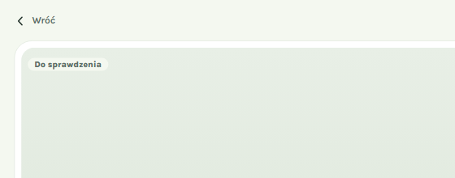

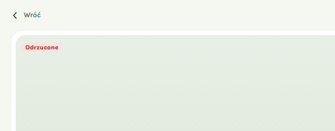

💡 Odrzucone zdjęcia nie wliczają się do limitu 10 zdjęć na rzecz, więc zawsze możesz dodać nowe.

---

## 3. Dla administratorów: kolejka zdjęć

*Panel administratora jest w języku angielskim, dlatego nazwy przycisków poniżej podajemy po angielsku.*

### Co jest w kolejce?

W menu **Moderation** sekcja **Photo review** zawiera teraz **wyłącznie zdjęcia**. Teksty nie trafiają już do kolejki — są sprawdzane od razu przy zapisie (zob. część 1).

Kolejka ma trzy zakładki:

- **Needs review** — zdjęcia, które czekają na Twoją decyzję. Tu zaglądaj najczęściej.
- **Pending (not scored yet)** — zdjęcia, których automat jeszcze nie sprawdził.
- **Rejected** — zdjęcia odrzucone.

### Jak czytać kartę zdjęcia?

Pod nazwą rzeczy jest linia z wynikami automatycznego sprawdzenia:

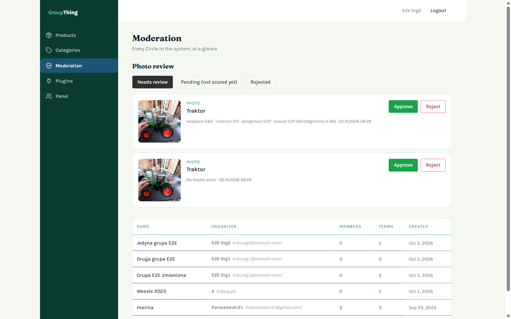

- **Wyniki w kategoriach** (np. `weapons 0.62 · violence 0.11 · …`) — im bliżej 1, tym większe podejrzenie danej kategorii (broń, przemoc, niebezpieczne treści, treści seksualne). Na początku jest kategoria z najwyższym wynikiem. W nawiasie widać nazwę modelu, który sprawdzał zdjęcie.
- **No model score** — automat **nie zdołał sprawdzić zdjęcia**, mimo kilku prób. Zdjęcie trafia wtedy do Ciebie do ręcznej oceny. Nie oznacza to, że zdjęcie jest złe — po prostu nikt go jeszcze nie ocenił.

💡 Zdjęcia, na których automat wykrył broń, zawsze trafiają do ręcznego sprawdzenia, a nigdy nie są odrzucane automatycznie — np. zabawkowy pistolet może być w porządku.

### Jak zatwierdzić lub odrzucić zdjęcie?

1. **Otwórz Moderation** w menu po lewej stronie.
2. **Wybierz zakładkę** — najczęściej **Needs review**.

   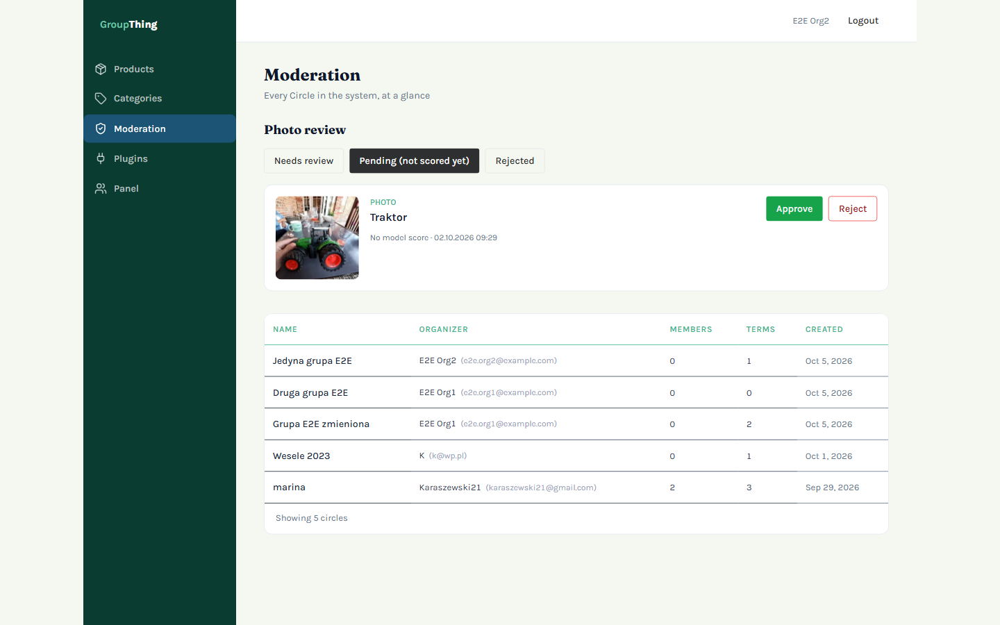

3. **Obejrzyj zdjęcie** i wyniki pod nazwą rzeczy.
4. Kliknij:
   - **Approve** — zdjęcie stanie się widoczne dla wszystkich,
   - **Reject** — zdjęcie zostanie ukryte, a właściciel zobaczy oznaczenie „Odrzucone”.

✅ **Co powinno się stać:** karta znika z kolejki, a właściciel rzeczy zobaczy nowy status na stronie rzeczy w ciągu kilku sekund.

💡 Możesz też zdecydować o zdjęciu z zakładki **Pending**, nie czekając na automat. Twoja decyzja nie zostanie później nadpisana.

---

## 4. Najczęstsze pytania

**Poprawiłem tylko datę terminu, a opis jest stary. Czy zostanie odrzucony?**
Nie. Sprawdzamy tylko tekst, który zmieniasz.

**Dostałem komunikat o naruszeniu zasad, ale nie wiem, co jest nie tak.**
Spróbuj sformułować tekst prościej i neutralnie, bez mocnych słów. Jeśli to nie pomaga, skontaktuj się z administratorem.

**Czy po odrzuceniu coś zostało zapisane?**
Nie. Przy odrzuceniu i przy komunikacie „Moderacja jest chwilowo niedostępna” nic się nie zapisuje.

**Moje zdjęcie od dawna ma oznaczenie „W moderacji”.**
Automat może być chwilowo niedostępny i próbuje kilka razy. Jeśli mimo to się nie uda, zdjęcie przejdzie do stanu „Do sprawdzenia” i oceni je administrator.

**Czy inni widzą moje zdjęcie „W moderacji” albo „Do sprawdzenia”?**
Nie. Inni widzą tylko zaakceptowane zdjęcia.
