# Motyw organizatora: Twoje kolory na stronach zajęć

*Ostatnia aktualizacja: 7 października 2026 · Wersja: A1 „Motyw”*

---

## Spis treści

1. [Czym jest motyw organizatora?](#czym-jest-motyw-organizatora)
2. [Dla kogo jest ta funkcja?](#dla-kogo-jest-ta-funkcja)
3. [Gdzie zobaczysz kolory organizatora](#gdzie-zobaczysz-kolory-organizatora)
4. [Jak to wygląda: strona zajęć](#jak-to-wygląda-strona-zajęć)
5. [Jak to wygląda: grupa prywatna](#jak-to-wygląda-grupa-prywatna)
6. [Jak obejrzeć rzecz w kolorach organizatora](#jak-obejrzeć-rzecz-w-kolorach-organizatora)
7. [Jak edytować swoją rzecz, nie wychodząc ze strony organizatora](#jak-edytować-swoją-rzecz-nie-wychodząc-ze-strony-organizatora)
8. [Strona organizatora](#strona-organizatora)
9. [Kiedy zobaczysz kolory domyślne](#kiedy-zobaczysz-kolory-domyślne)
10. [Dla organizatorów: jak ustawić swoje kolory (na razie przez API)](#dla-organizatorów-jak-ustawić-swoje-kolory-na-razie-przez-api)
11. [Pytania i problemy](#pytania-i-problemy)

---

## Czym jest motyw organizatora?

Każdy organizator zajęć może mieć **własne kolory**: kolor główny i kolor dodatkowy. Gdy je ustawi, jego strony wyglądają jak „jego miejsce”, a nie jak ogólna strona aplikacji.

Kolor główny widać na najważniejszych przyciskach i oznaczeniach. Kolor dodatkowy widać na małych etykietach, na przykład „Organizacja”.

Twój panel („Home”, „Moje rzeczy”, „Wypożyczone”) **zawsze** ma kolory aplikacji, niezależnie od tego, czyją stronę oglądałeś wcześniej.

💡 **Dobrze wiedzieć**: aplikacja sama dba o to, żeby tekst był czytelny. Jeśli wybrany kolor jest zbyt jasny, aplikacja lekko go przyciemni. Dlatego kolor na ekranie może się trochę różnić od tego, który podał organizator.

---

## Dla kogo jest ta funkcja?

- **Uczestnicy i goście**: otwierasz link do zajęć od organizatora i od razu widzisz jego kolory.
- **Członkowie grup**: oglądasz rzeczy udostępnione na zajęciach, a strona rzeczy zostaje w kolorach organizatora.
- **Organizatorzy**: Twoje zajęcia, Twoja strona i rzeczy oglądane z Twoich zajęć wyglądają spójnie, w Twoich barwach.

⚠️ **Uwaga dla organizatorów**: w tej wersji **nie ma jeszcze ekranu do wyboru kolorów**. Kolory ustawia się technicznie (szczegóły w sekcji [Dla organizatorów](#dla-organizatorów-jak-ustawić-swoje-kolory-na-razie-przez-api)). **Wkrótce: edytor wyglądu**, w którym kolory wybierzesz samodzielnie.

---

## Gdzie zobaczysz kolory organizatora

| Miejsce | Adres (przykład) | Kolory |
|---|---|---|
| Strona zajęć (terminu) | `/pracownia-pod-lipa/grupa/…/term/…` | organizatora |
| Ekran grupy prywatnej | ten sam adres, gdy grupa jest prywatna | organizatora |
| Rzecz otwarta ze strony zajęć | `/pracownia-pod-lipa/produkt/…` | organizatora |
| Edycja Twojej rzeczy otwartej ze strony zajęć | `/pracownia-pod-lipa/produkt/…/edit` | organizatora |
| Strona organizatora | `/pracownia-pod-lipa` | organizatora |
| Twój panel i „Moje rzeczy” | `/panel`, `/product/…` | zawsze domyślne kolory aplikacji |

---

## Jak to wygląda: strona zajęć

Strona zajęć to miejsce, do którego prowadzi link wysłany przez organizatora. Widać na niej, kto przychodzi, kto co udostępnia i kiedy są zajęcia.

### Bez własnych kolorów (wygląd domyślny)

Gdy organizator nie ustawił kolorów, strona ma zielone barwy aplikacji.

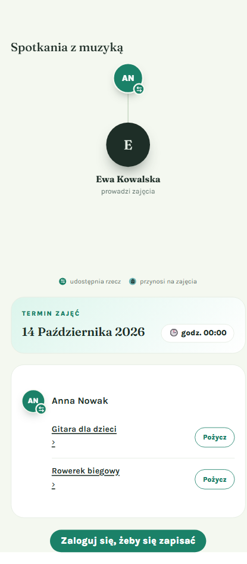

### Z kolorami organizatora

Ta sama strona, gdy organizator wybrał kolor bordowy:

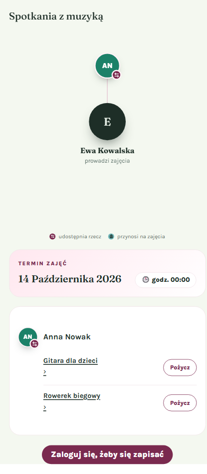

✅ **Co zmienia kolor**:
- **przycisk na dole**: „Zaloguj się, żeby się zapisać” albo „Zapisz się na zajęcia”;
- **znaczek „udostępnia rzecz”** przy osobie i w legendzie;
- **linie** łączące uczestników z prowadzącym;
- **napis „TERMIN ZAJĘĆ”** i delikatne tło karty z datą;
- **przyciski „Pożycz”** przy rzeczach.

📝 **Co się nie zmienia**: kółka z inicjałami uczestników (np. „AN”) mają stałe kolory. Pomagają odróżniać osoby, więc nie zależą od motywu. Znaczek „przynosi na zajęcia” zawsze jest turkusowy.

### Po zalogowaniu

Gdy jesteś zalogowany i jeszcze nie zapisałeś się na zajęcia, na dole zobaczysz przycisk **„Zapisz się na zajęcia”** w kolorze organizatora:

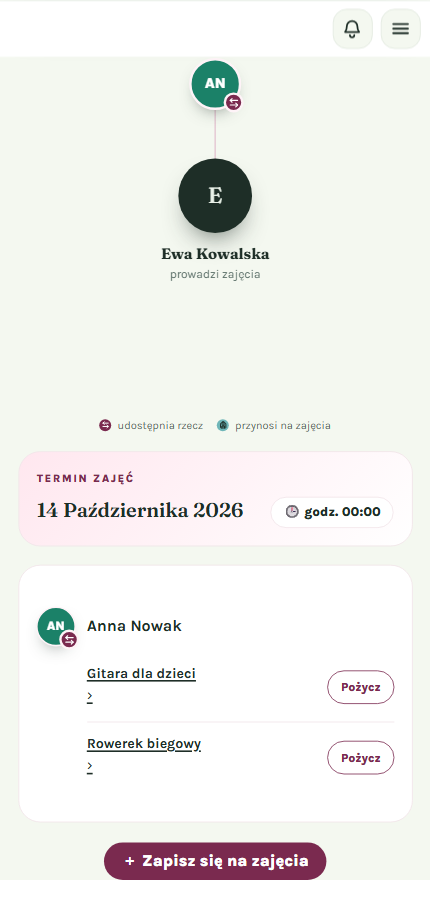

Okno zapisu, które otwiera się po kliknięciu, również ma kolory organizatora:

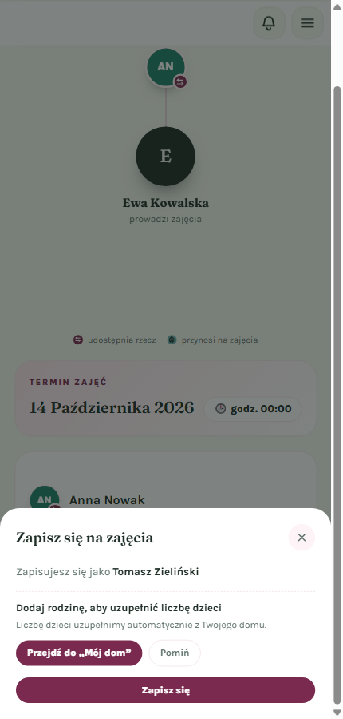

---

## Jak to wygląda: grupa prywatna

Jeśli grupa jest prywatna, a Ty nie jesteś jej członkiem, zobaczysz informację „Ta grupa jest prywatna”. Ten ekran też jest w kolorach organizatora, więc od razu wiesz, czyja to grupa.

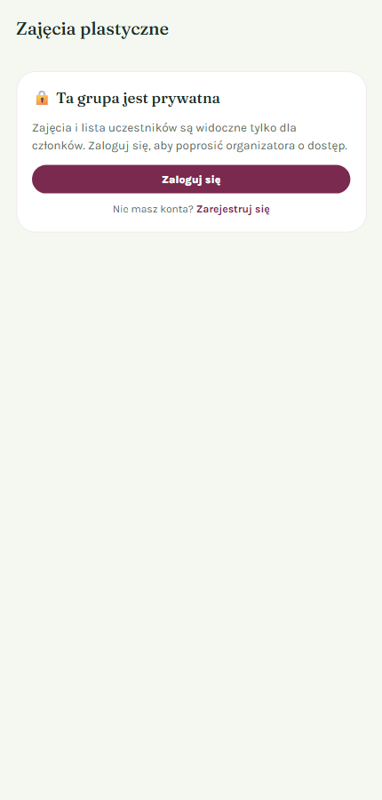

**Co możesz zrobić**:
1. Kliknij **„Zaloguj się”**, jeśli masz konto.
2. Kliknij **„Zarejestruj się”**, jeśli jeszcze go nie masz.
3. Po zalogowaniu możesz poprosić organizatora o dostęp.

---

## Jak obejrzeć rzecz w kolorach organizatora

Na stronie zajęć widać rzeczy, które uczestnicy udostępniają (np. „Gitara dla dzieci”). Możesz otworzyć szczegóły każdej z nich.

**Czego potrzebujesz**:
- 📝 konta w aplikacji (oglądanie szczegółów rzeczy wymaga zalogowania).

**Kroki**:

1. **Kliknij nazwę rzeczy na stronie zajęć**

   Nazwy rzeczy są podkreślone, na przykład „Gitara dla dzieci” albo „Rowerek biegowy”.

2. **Zaloguj się, jeśli aplikacja o to poprosi**

   Jeśli nie jesteś zalogowany, zobaczysz ekran logowania. Wpisz swój e-mail i hasło, a potem kliknij **„Zaloguj się”**.

   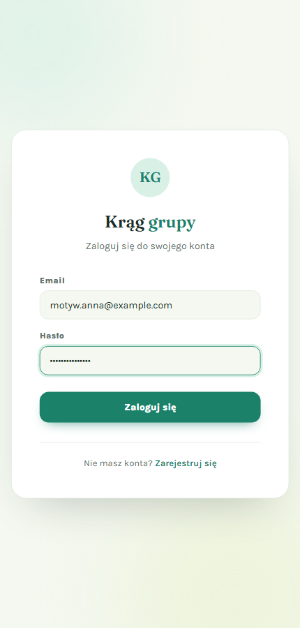

   💡 **Wskazówka**: nie musisz niczego szukać po zalogowaniu. Aplikacja sama przeniesie Cię do rzeczy, którą chciałeś obejrzeć.

3. **Obejrzyj rzecz**

   Strona rzeczy ma kolory organizatora: tło, etykietę „Dostępna” i datę w historii.

   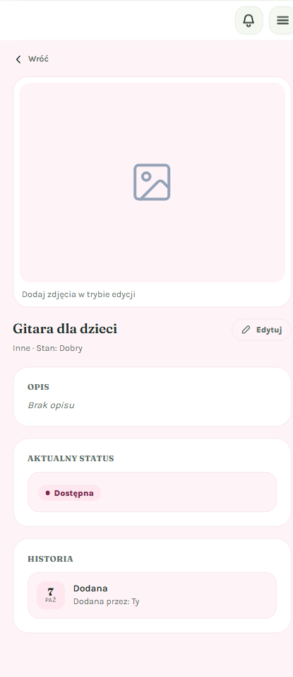

   ✅ **Co powinieneś zobaczyć**:
   - kolory organizatora;
   - **brak dolnego paska panelu** („Home”, „Spotkania”, „Moje rzeczy”, „Wypożyczone”). Jesteś nadal „u organizatora”, nie w swoim panelu;
   - w pasku adresu: nazwę organizatora i słowo `produkt`, np. `/pracownia-pod-lipa/produkt/…`.

4. **Wróć do zajęć**

   Kliknij **„Wróć”** w lewym górnym rogu. Wrócisz na stronę zajęć, z której przyszedłeś.

   💡 **Wskazówka**: jeśli otworzyłeś stronę rzeczy bezpośrednio z linku (a nie ze strony zajęć), „Wróć” przeniesie Cię na stronę organizatora.

---

## Jak edytować swoją rzecz, nie wychodząc ze strony organizatora

Jeśli rzecz jest Twoja, przy jej nazwie zobaczysz przycisk **„Edytuj”**. Możesz poprawić opis, stan albo zdjęcia, nie wychodząc ze strony organizatora.

**Kroki**:

1. **Kliknij „Edytuj”** obok nazwy rzeczy.

2. **Wprowadź zmiany**

   Kliknij ikonę ołówka przy sekcji, którą chcesz zmienić (np. „Opis”). Wpisz treść, na przykład „Gitara 1/2, nowe struny, idealna dla 5-latka”, i kliknij **„Zapisz”**.

   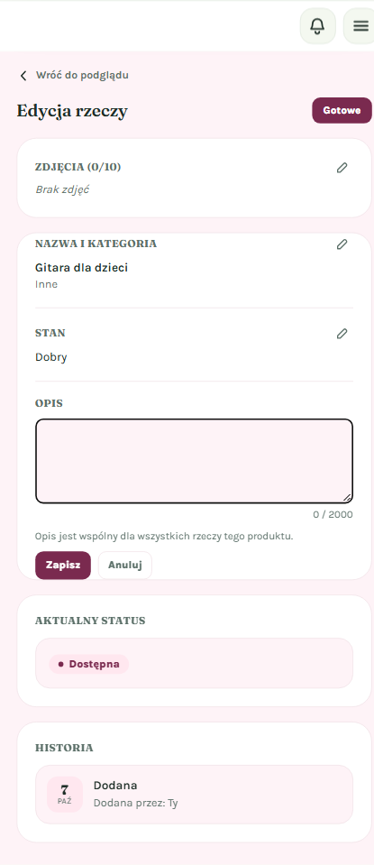

   ✅ **Co powinieneś zobaczyć**: przyciski **„Gotowe”** i **„Zapisz”** w kolorze organizatora, a w pasku adresu nadal nazwę organizatora, np. `/pracownia-pod-lipa/produkt/…/edit`.

3. **Kliknij „Gotowe”** albo **„Wróć do podglądu”**

   Wrócisz do podglądu rzeczy, nadal w kolorach organizatora.

4. **Kliknij „Wróć”**, aby wrócić na stronę zajęć.

   💡 **Wskazówka**: „Wróć” działa jak przycisk „wstecz” w przeglądarce. Po edycji może być potrzebne kliknięcie go więcej niż raz, zanim znów zobaczysz stronę zajęć.

---

## Strona organizatora

Pod adresem z nazwą organizatora (np. `/pracownia-pod-lipa`) znajduje się jego wizytówka. Ona również ma kolory organizatora: tło strony i etykieta „Organizacja”.

**Bez własnych kolorów:**

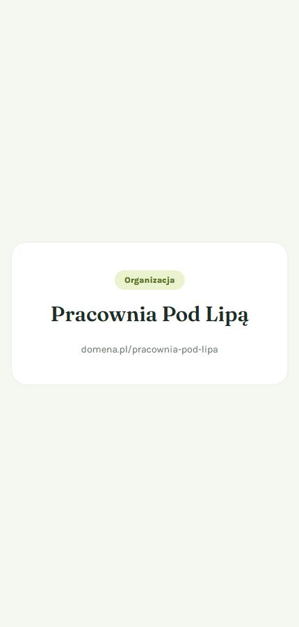

**Z kolorami organizatora** (bordowy kolor główny, złocisty kolor dodatkowy):

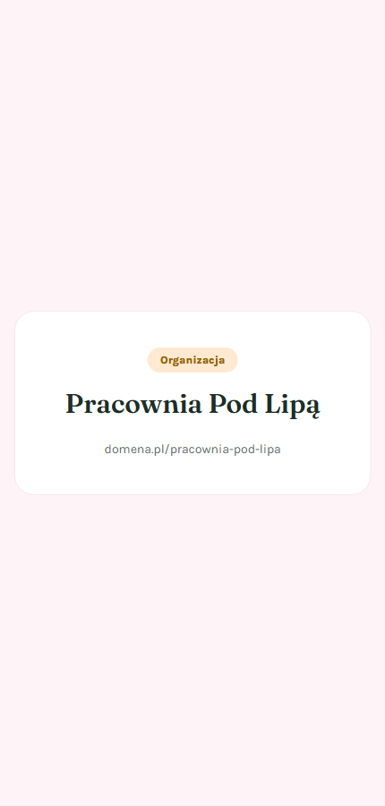

---

## Kiedy zobaczysz kolory domyślne

Kolory domyślne (zielone barwy aplikacji) zobaczysz, gdy:

- **organizator nie ustawił kolorów**;
- organizator ustawił **tylko kolor dodatkowy**, bez głównego. Wtedy aplikacja używa całego domyślnego zestawu;
- organizator **nie ma jeszcze założonej organizacji** (adres zaczyna się wtedy od `k-…`);
- strona organizatora **jeszcze się wczytuje**. Przez chwilę widzisz neutralny ekran ładowania, a potem treść w docelowych kolorach;
- jesteś w **swoim panelu**: „Home”, „Spotkania”, „Moje rzeczy”, „Wypożyczone”, a także na stronie rzeczy otwartej z „Moje rzeczy” (adres `/product/…`).

Tak wygląda ta sama rzecz otwarta z „Moje rzeczy”. Ma kolory aplikacji i dolny pasek panelu:

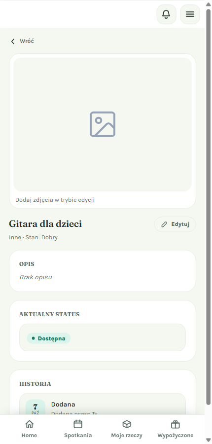

Porównaj ją z [tą samą rzeczą otwartą ze strony zajęć](#jak-obejrzeć-rzecz-w-kolorach-organizatora).

📝 **Przy okazji poprawiliśmy czytelność kolorów domyślnych.** Niektóre napisy (np. „TERMIN ZAJĘĆ”, „Wróć”, etykieta „Dostępna”) są teraz odrobinę ciemniejsze, a jasne tła odrobinę jaśniejsze. Dzięki temu tekst lepiej odcina się od tła.

---

## Dla organizatorów: jak ustawić swoje kolory (na razie przez API)

> ⚠️ **Wkrótce: edytor wyglądu.** W kolejnej wersji wybierzesz kolory na ekranie ustawień organizacji. Do tego czasu kolory może ustawić osoba z dostępem technicznym (np. administrator lub zespół wsparcia), korzystając z poniższej instrukcji.

### Czego potrzebujesz

- 📝 konta organizatora z założoną organizacją;
- 📝 identyfikatora organizacji (`id`);
- 📝 tokenu logowania tego konta (nagłówek `Authorization: Bearer …`);
- 📝 dwóch kolorów w formacie `#RRGGBB`, np. `#7A2A4F` (bordowy) i `#E0A458` (złocisty).

### Kroki (wersja techniczna)

1. **Wyślij żądanie zmiany kolorów**

   ```
   PATCH /api/organizations/{id}
   Content-Type: application/json
   Authorization: Bearer <token organizatora>

   {"primary_color": "#7A2A4F", "accent_color": "#E0A458"}
   ```

   - `primary_color` to kolor główny: przyciski, znaczki, linie;
   - `accent_color` to kolor dodatkowy: małe etykiety. Możesz go pominąć, wtedy aplikacja dobierze go sama.

2. **Sprawdź efekt**

   Otwórz stronę organizatora (np. `/pracownia-pod-lipa`) albo dowolne jego zajęcia i odśwież stronę.

### Ważne zasady

- ✅ **Kolory są automatycznie dopasowywane do czytelności.** Aplikacja sprawdza kontrast według standardu dostępności WCAG. Jeśli kolor jest zbyt jasny, zostanie przyciemniony, więc **kolor na ekranie może być nieco ciemniejszy** niż podany. Na przykład dla jasnożółtego `#F1C40F` napisy w kolorze marki będą ciemnozłote. Bordowy `#7A2A4F` jest wystarczająco ciemny i pozostaje bez zmian.
- ⚠️ **Musisz podać kolor główny.** Jeśli ustawisz tylko kolor dodatkowy, strony będą miały kolory domyślne.
- ⚠️ **Na razie nie da się „wyczyścić” kolorów.** Wysłanie `null` niczego nie zmienia. Aby wrócić do wyglądu podobnego do domyślnego, ustaw kolory aplikacji: `{"primary_color": "#1B8168", "accent_color": "#A9C24F"}`.
- ❌ Nie używaj nazw kolorów (`"red"`) ani skrótów (`"#F00"`). Akceptowany jest tylko pełny format `#RRGGBB`.

---

## Pytania i problemy

**Organizator ustawił kolory, ale nadal widzę zieloną stronę.**
- Odśwież stronę.
- Sprawdź, czy organizator podał **kolor główny**. Sam kolor dodatkowy nie wystarczy.
- Sprawdź adres. Jeśli zaczyna się od `k-…`, organizator nie ma jeszcze organizacji, więc kolory nie mają gdzie się zapisać.

**Kliknąłem rzecz i zobaczyłem ekran logowania.**
To normalne: szczegóły rzeczy widzą tylko zalogowane osoby. Po zalogowaniu wrócisz prosto do tej rzeczy.

**Kolor na stronie różni się od koloru mojej marki.**
Aplikacja przyciemniła go, żeby tekst był czytelny dla wszystkich, także dla osób słabiej widzących. To zamierzone.

**Po wejściu na stronę rzeczy przez chwilę widzę zielony ekran ładowania.**
Aplikacja pobiera wtedy kolory organizatora. Treść pojawi się już w docelowych kolorach.

**Nie widzę dolnego paska z „Moje rzeczy”.**
Na stronie rzeczy otwartej ze strony zajęć tego paska celowo nie ma. Aby przejść do panelu, użyj menu w prawym górnym rogu albo otwórz rzecz z „Moje rzeczy”.

**Czy moje powiadomienia albo panel zmienią kolor po wizycie u organizatora?**
Nie. Panel, powiadomienia i górny pasek konta zawsze mają kolory aplikacji.

---

## Powiązane funkcje

- **Strona zajęć**: zapisy, udostępnianie i wypożyczanie rzeczy.
- **Moje rzeczy**: dodawanie i edycja własnych rzeczy w panelu.
- **Wkrótce: edytor wyglądu (A2)**: samodzielny wybór kolorów i gotowych zestawów barw w ustawieniach organizacji.
