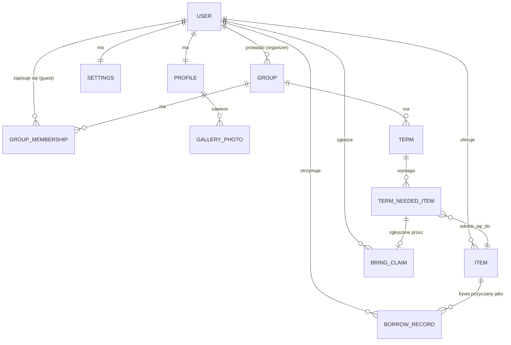

# Rodzinny grajdołek — dokumentacja projektu

> Prototyp UI (React + TypeScript + Vite) platformy dla grup zajęć umuzykalniających dla dzieci 0–6 lat. Cały stan aplikacji żyje dziś lokalnie w `useState` na każdej stronie osobno — nie ma backendu, bazy danych ani wspólnego stanu między panelami. Ten dokument opisuje, co aplikacja robi, oraz jakie encje trzeba by zaprojektować, żeby zbudować za nią prawdziwą bazę danych i backend.

## 1. Czym jest aplikacja

Platforma łącząca dwie role — **prowadzącą zajęcia** (organizatorkę) i **rodzica** (gościa) — wokół dwóch potrzeb:

1. Organizacji zajęć: grupy, terminy, kto się zapisał, czego potrzeba na spotkanie.
2. Lokalnej gospodarki wymiany: rodzice pożyczają, oddają i wymieniają się rzeczami dla dzieci (grzechotki, maty, książeczki), zamiast je kupować.

## 2. Mapa stron

| Strona | Plik | Rola | Zawartość |
|---|---|---|---|
| Strona główna | `StronaGlowna.tsx` | odwiedzający | landing page marketingowy |
| Profil prowadzącej | `ProfilMobilny.tsx` | rodzic | wizytówka, galeria, najbliższe terminy, liczniki wymiany |
| Krąg grupy (+ wariant na start) | `KragGrupy.tsx`, `KragGrupyStart.tsx` | rodzic | krąg rodzin, kto co przynosi, dobrowolne zgłoszenia |
| Panel organizatora | `PanelOrganizatora.tsx` | prowadząca | grupy, terminy (z listą potrzebnych rzeczy), moje rzeczy, podarki, profil, ustawienia |
| Panel gościa | `PanelGoscia.tsx` | rodzic | jego terminy, jego rzeczy, podarki, profil, ustawienia |
| Galeria zdjęć | `GaleriaZdjec.tsx` | rodzic | pełnoekranowa galeria z lightboxem |

## 3. Model danych — encje do bazy danych

Poniżej encje wyprowadzone z tego, co dziś istnieje jako osobne, niepowiązane mocki na poszczególnych stronach. W nawiasach — z której strony pochodzi dana koncepcja.

### 3.1 `User`
Wspólna tożsamość dla obu ról (dziś: `Profile` w `PanelOrganizatora.tsx` i `PanelGoscia.tsx` to dwa oddzielne, niepowiązane obiekty).

| Pole | Typ | Uwagi |
|---|---|---|
| `id` | uuid | PK |
| `email` | string | unikalny, do logowania |
| `password_hash` | string | |
| `role` | enum(`organizer`, `guest`) | dziś rozdzielone jako dwie osobne strony |
| `created_at` | timestamp | |

### 3.2 `Profile`
1:1 z `User`. (Pola z `Profile` w obu panelach oraz `ProfilMobilny.tsx`.)

| Pole | Typ | Uwagi |
|---|---|---|
| `id` | uuid | PK |
| `user_id` | uuid | FK → `User`, unikalny |
| `display_name` | string | np. „Zuzanna Karaszewska”, „Marta Wiśniewska” |
| `bio` | text | |
| `location` | string | np. „Poznań, Jeżyce” |
| `avatar_url` | string | |
| `hero_photo_url` | string | tylko dla organizatora — duże zdjęcie w profilu |

### 3.3 `GalleryPhoto`
Galeria profilu prowadzącej (`data/photos.ts` → `GALLERY`, `GaleriaZdjec.tsx`).

| Pole | Typ | Uwagi |
|---|---|---|
| `id` | uuid | PK |
| `profile_id` | uuid | FK → `Profile` |
| `url` | string | |
| `label` | string | podpis zdjęcia |
| `sort_order` | int | kolejność w galerii |

### 3.4 `Group`
Grupa zajęciowa prowadzona przez organizatorkę (`Group` w `PanelOrganizatora.tsx`).

| Pole | Typ | Uwagi |
|---|---|---|
| `id` | uuid | PK |
| `organizer_id` | uuid | FK → `User` (role=organizer) |
| `name` | string | np. „Muzyczne Maluchy” |
| `location` | string | np. „Sala nr 2, Poznań Jeżyce” |
| `age_range` | string | opcjonalnie, dziś usunięte z formularza, ale sensowne w DB |
| `free_spots` | int | |

### 3.5 `GroupMembership`
Zapis rodzica do grupy — dziś reprezentowane fragmentarycznie przez `FAMILIES` w `KragGrupy.tsx` i `MY_TERMS`/profil w `PanelGoscia.tsx`. Łączy `User` (guest) z `Group`.

| Pole | Typ | Uwagi |
|---|---|---|
| `id` | uuid | PK |
| `group_id` | uuid | FK → `Group` |
| `guest_id` | uuid | FK → `User` |
| `child_name` | string | np. „Zosia” (`kids` w `FAMILIES`) |
| `child_age` | string | np. „2 lata” |
| `avatar_color` | string | kolor awatara w kręgu grupy |
| `avatar_initials` | string | np. „WI” |
| `joined_at` | timestamp | |
| `status` | enum(`active`, `cancelled`) | |

### 3.6 `Term`
Termin/spotkanie danej grupy (`Term` w `PanelOrganizatora.tsx`/`PanelGoscia.tsx`).

| Pole | Typ | Uwagi |
|---|---|---|
| `id` | uuid | PK |
| `group_id` | uuid | FK → `Group` |
| `date` | date | dziś rozbite na `day`+`month` w UI |
| `time_note` | string | np. „16:30 · Sala nr 2 · zostały 2 miejsca” |

### 3.7 `TermNeededItem` (tabela łącząca)
Rzeczy zgłoszone przez organizatorkę jako potrzebne na dany termin — powstaje po zaznaczeniu checkboxa „Potrzebuję rzeczy na zajęcia” w modalu dodawania terminu.

| Pole | Typ | Uwagi |
|---|---|---|
| `term_id` | uuid | FK → `Term` |
| `item_id` | uuid | FK → `Item` (rzecz organizatorki) |

### 3.8 `BringClaim`
Dobrowolne zgłoszenie rodzica „ja to przyniosę” w Kręgu grupy (`BringClaim`/`NEEDED_ITEMS` w `KragGrupy.tsx`).

| Pole | Typ | Uwagi |
|---|---|---|
| `id` | uuid | PK |
| `term_needed_item_id` | uuid | FK → `TermNeededItem` |
| `claimed_by_id` | uuid | FK → `User` (guest), `null` = jeszcze niezadeklarowane |
| `claimed_at` | timestamp | |

### 3.9 `Item`
Rzecz, którą użytkownik oferuje innym — sekcja „Moje rzeczy” (`Item`/`ItemMode` w obu panelach).

| Pole | Typ | Uwagi |
|---|---|---|
| `id` | uuid | PK |
| `owner_id` | uuid | FK → `User` |
| `name` | string | |
| `mode` | enum(`wypożyczę`, `oddam`, `zamienię`) nullable | `null` = jeszcze nieprzypisany tryb |
| `created_at` | timestamp | |

### 3.10 `BorrowRecord` (dziś „Podarek” / `Gift`)
Rzecz otrzymana/pożyczona/wymieniona od innego użytkownika — sekcja „Podarki” (`Gift`/`GiftSource` w obu panelach).

| Pole | Typ | Uwagi |
|---|---|---|
| `id` | uuid | PK |
| `item_id` | uuid nullable | FK → `Item`, jeśli powiązane z konkretną ofertą |
| `from_user_id` | uuid nullable | kto dał/wymienił się |
| `to_user_id` | uuid | FK → `User`, kto otrzymał |
| `source` | enum(`pożyczone`, `otrzymane`, `zamienione`) | |
| `status` | enum(`active`, `returned`) | patrz sekcja 4 — proces zwrotu |
| `borrowed_at` | timestamp | |
| `returned_at` | timestamp nullable | |

### 3.11 `Settings`
1:1 z `User` (`settings` w obu panelach).

| Pole | Typ | Uwagi |
|---|---|---|
| `user_id` | uuid | FK → `User`, unikalny |
| `email_notifications` | bool | |
| `sms_notifications` | bool | |
| `public_profile` | bool | |

## 4. Relacje (diagram)

## 5. Co jest dziś mockiem, a czego brakuje do prawdziwego backendu

- **Brak wspólnego stanu.** Panel organizatora i panel gościa mają dziś dwa osobne, niepowiązane obiekty `Profile`/`Item`/`Term` w lokalnym `useState`. W realnym systemie to jeden rekord `User`/`Item`/`Term`, czytany przez obie strony przez API.
- **Brak logowania i ról.** Nawigacja między stronami to dziś przełącznik w `App.tsx`, nie prawdziwa autentykacja.
- **Proces zwrotu pożyczonej rzeczy jest deklaratywny, nie weryfikowany** — kliknięcie „Zwróć” zmienia status na `returned`, ale nic nie potwierdza, że rzecz faktycznie wróciła fizycznie do właściciela. To świadoma decyzja projektowa (patrz ustalenia w rozmowie), a nie luka do automatycznego załatania — realne wdrożenie polegałoby na zaufaniu społecznym w grupie, ewentualnie o dwustronne potwierdzenie (`to_user_id` zgłasza zwrot → `from_user_id` potwierdza odbiór), co wymaga wspólnego stanu wspomnianego wyżej.
- **Zdjęcia** to dziś placeholdery (`picsum.photos`, `i.pravatar.cc`) — do podmiany na realny upload/storage (`avatar_url`, `hero_photo_url`, `GalleryPhoto.url`).
